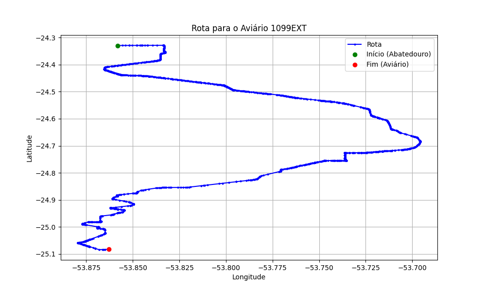

# Relatório de Rota - Aviário 1099EXT

## Informações Gerais
- **Produtor:** PLUMA GUSTAVO TASCA FERREIRA 01
- **Latitude:** -25.082975
- **Longitude:** -53.862953

## Dados da Rota
- **Distância Real:** 107.01 km
- **Tempo Estimado (OSRM):** 103.0 minutos
- **Tempo Estimado (40 km/h):** 160.5 minutos

## Mapa da Rota

[Visualizar Mapa Interativo](mapa_interativo.html)

## Rota até o aviário
1. Saia da rua sem nome, siga por 10m.
2. Vire à direita na Avenida Ariosvaldo Bitencourt, siga por 200m.
3. Siga em frente na Avenida Ariosvaldo Bitencourt, siga por 2,6 km.
4. Vire em frente na Rodovia Alberto Dalcanale, siga por 51,8 km.
5. New name em frente na Avenida Parigot de Souza, siga por 330m.
6. Roundabout em frente na Avenida José João Muraro, siga por 50m.
7. Exit roundabout à direita na Avenida José João Muraro, siga por 990m.
8. Roundabout à direita na Avenida José João Muraro, siga por 20m.
9. Exit roundabout levemente à direita na Avenida José João Muraro, siga por 1,2 km.
10. Roundabout à direita na Rua São João, siga por 50m.
11. Exit roundabout em frente na Rua São João, siga por 820m.
12. Roundabout levemente à direita na Avenida Senador Atílio Fontana, siga por 20m.
13. Exit roundabout levemente à direita na Avenida Senador Atílio Fontana, siga por 2,3 km.
14. Roundabout levemente à direita na Rua Egydio Geronymo Munaretto, siga por 0m.
15. Exit roundabout levemente à direita na Rua Egydio Geronymo Munaretto, siga por 70m.
16. New name em frente na PR-182, siga por 240m.
17. New name em frente na PR -317, siga por 890m.
18. Roundabout em frente na Rodovia Egon Pudell, siga por 50m.
19. Exit roundabout em frente na Rodovia Egon Pudell, siga por 1,0 km.
20. Vire em frente na Rodovia Egon Pudell, siga por 24,3 km.
21. Rotary em frente na Avenida São Paulo, siga por 80m.
22. Exit rotary levemente à direita na Avenida São Paulo, siga por 560m.
23. Rotary à direita na Avenida São Paulo, siga por 80m.
24. Exit rotary à direita na Avenida São Paulo, siga por 490m.
25. Vire levemente à direita na Rodovia Egon Pudell, siga por 40m.
26. Fork levemente à direita na Rodovia Egon Pudell, siga por 13,8 km.
27. New name levemente à esquerda na Avenida Antônio Villas-Boas, siga por 1,5 km.
28. Roundabout à direita na Avenida Pedro Álvares Cabral, siga por 30m.
29. Exit roundabout à direita na Avenida Pedro Álvares Cabral, siga por 3,0 km.
30. Vire à esquerda na rua sem nome, siga por 540m.
31. Você chegará ao aviário 1099EXT.
