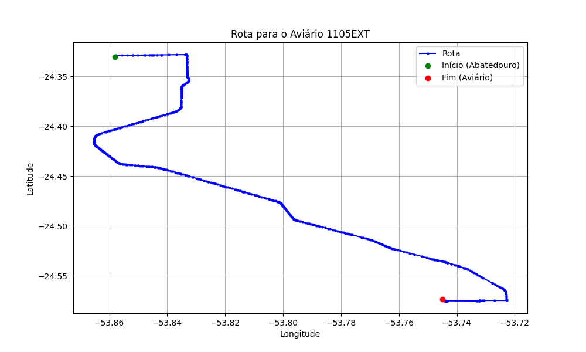

# Relatório de Rota - Aviário 1105EXT

## Informações Gerais
- **Produtor:** PLUMA GERALDO CARLOS MACHADO 01
- **Latitude:** -24.573529
- **Longitude:** -53.745026

## Dados da Rota
- **Distância Real:** 39.92 km
- **Tempo Estimado (OSRM):** 39.6 minutos
- **Tempo Estimado (40 km/h):** 59.9 minutos

## Mapa da Rota

[Visualizar Mapa Interativo](mapa_interativo.html)

## Rota até o aviário
1. Saia da rua sem nome, siga por 10m.
2. Vire à direita na Avenida Ariosvaldo Bitencourt, siga por 200m.
3. Siga em frente na Avenida Ariosvaldo Bitencourt, siga por 2,6 km.
4. Vire em frente na Rodovia Alberto Dalcanale, siga por 34,6 km.
5. Vire à direita na rua sem nome, siga por 2,2 km.
6. End of road à direita na rua sem nome, siga por 210m.
7. Vire à esquerda na rua sem nome, siga por 80m.
8. Você chegará ao aviário 1105EXT à esquerda.
