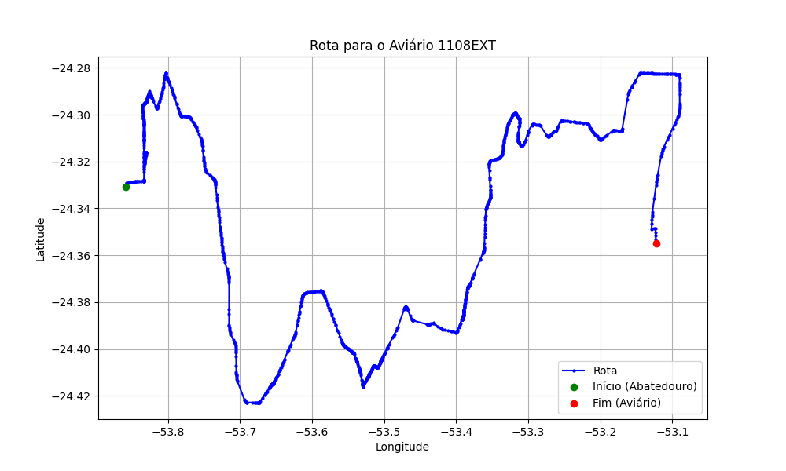

# Relatório de Rota - Aviário 1108EXT

## Informações Gerais
- **Produtor:** COPACOL VICENTE PEREIRA DA SILVA 2
- **Latitude:** -24.355107
- **Longitude:** -53.123792

## Dados da Rota
- **Distância Real:** 120.15 km
- **Tempo Estimado (OSRM):** 121.1 minutos
- **Tempo Estimado (40 km/h):** 180.2 minutos

## Mapa da Rota

[Visualizar Mapa Interativo](mapa_interativo.html)

## Rota até o aviário
1. Saia da rua sem nome, siga por 10m.
2. Vire à direita na Avenida Ariosvaldo Bitencourt, siga por 200m.
3. Siga em frente na Avenida Ariosvaldo Bitencourt, siga por 2,5 km.
4. Vire à esquerda na rua sem nome, siga por 1,5 km.
5. Vire levemente à esquerda na rua sem nome, siga por 660m.
6. Vire em frente na Rodovia Alberto Dalcanale, siga por 1,7 km.
7. New name em frente na Avenida Presidente Kennedy, siga por 960m.
8. Vire à direita na Rua Juscelino Kubitscheck, siga por 1,3 km.
9. Vire à direita na Rua Madre Teresa de Calcutá, siga por 440m.
10. New name em frente na rua sem nome, siga por 880m.
11. Vire à esquerda na rua sem nome, siga por 2,1 km.
12. Vire levemente à direita na Rodovia Deputado Edilson Alencar, siga por 24,6 km.
13. New name em frente na Avenida Sudoeste, siga por 490m.
14. End of road à direita na Avenida Praça São Roque, siga por 210m.
15. Vire à direita na Avenida Nordeste, siga por 540m.
16. New name em frente na Rodovia Deputado Edilson Alencar, siga por 14,7 km.
17. Vire à direita na rua sem nome, siga por 190m.
18. Vire em frente na Avenida Londrina, siga por 710m.
19. Vire à esquerda na rua sem nome, siga por 60m.
20. New name levemente à esquerda na rua sem nome, siga por 1,8 km.
21. Fork levemente à direita na Avenida Dom Pedro II, siga por 510m.
22. Siga em frente na Avenida Dom Pedro II, siga por 13,3 km.
23. Vire levemente à direita na rua sem nome, siga por 40m.
24. Siga em frente na rua sem nome, siga por 70m.
25. Vire à direita na Avenida Papa São Zeferino, siga por 230m.
26. Vire à esquerda na Rua Padre Manoel de Nóbrega, siga por 14,3 km.
27. Vire à direita na Avenida São Paulo, siga por 100m.
28. Vire levemente à direita na Rodovia PR 317, siga por 25,9 km.
29. Vire levemente à direita na rua sem nome, siga por 50m.
30. Fork levemente à direita na Rodovia Vereador Jocelino Pereira dos Santos, siga por 8,8 km.
31. Vire à esquerda na rua sem nome, siga por 530m.
32. Vire à direita na rua sem nome, siga por 740m.
33. Você chegará ao aviário 1108EXT à direita.
