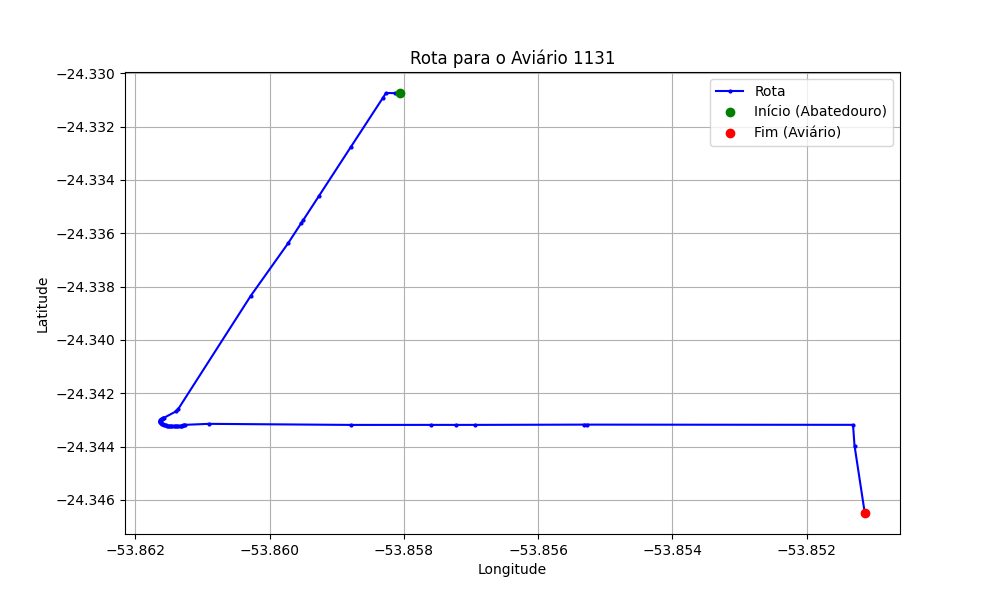

# Relatório de Rota - Aviário 1131

## Informações Gerais
- **Produtor:** ARI PATEL
- **Latitude:** -24.353417
- **Longitude:** -53.85265

## Dados da Rota
- **Distância Real:** 2.86 km
- **Tempo Estimado (OSRM):** 5.7 minutos
- **Tempo Estimado (40 km/h):** 4.3 minutos

## Mapa da Rota

[Visualizar Mapa Interativo](mapa_interativo.html)

## Rota até o aviário
1. Saia da rua sem nome, siga por 10m.
2. Vire à esquerda na Avenida Ariosvaldo Bitencourt, siga por 1,4 km.
3. Roundabout em frente na rua sem nome, siga por 70m.
4. Exit roundabout levemente à direita na rua sem nome, siga por 600m.
5. New name em frente na rua sem nome, siga por 410m.
6. Vire à direita na rua sem nome, siga por 370m.
7. Você chegará ao aviário 1131.
