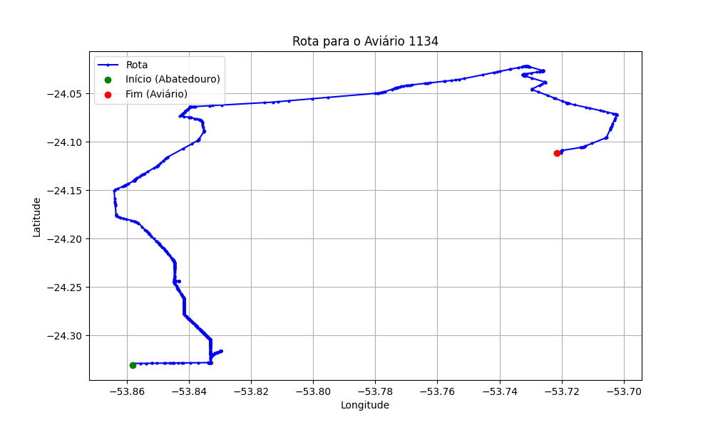

# Relatório de Rota - Aviário 1134

## Informações Gerais
- **Produtor:** GERVASIO RIBEIRO MORAES
- **Latitude:** -24.111019
- **Longitude:** -53.721472

## Dados da Rota
- **Distância Real:** 60.19 km
- **Tempo Estimado (OSRM):** 66.4 minutos
- **Tempo Estimado (40 km/h):** 90.3 minutos

## Mapa da Rota

[Visualizar Mapa Interativo](mapa_interativo.html)

## Rota até o aviário
1. Saia da rua sem nome, siga por 10m.
2. Vire à direita na Avenida Ariosvaldo Bitencourt, siga por 200m.
3. Siga em frente na Avenida Ariosvaldo Bitencourt, siga por 2,5 km.
4. Vire à esquerda na rua sem nome, siga por 1,5 km.
5. Vire levemente à esquerda na rua sem nome, siga por 660m.
6. Vire em frente na Rodovia Alberto Dalcanale, siga por 1,7 km.
7. New name em frente na Avenida Presidente Kennedy, siga por 7,2 km.
8. Fork levemente à direita na rua sem nome, siga por 20,3 km.
9. Vire à direita na Avenida Brigadeiro Pamplona Pinto, siga por 1,1 km.
10. Siga em frente na rua sem nome, siga por 130m.
11. Siga em frente na rua sem nome, siga por 12,0 km.
12. Vire levemente à direita na rua sem nome, siga por 100m.
13. Vire levemente à direita na Estrada Oroite, siga por 720m.
14. Vire levemente à direita na rua sem nome, siga por 800m.
15. Vire levemente à esquerda na rua sem nome, siga por 1,6 km.
16. New name em frente na rua sem nome, siga por 550m.
17. New name levemente à esquerda na Estrada Santa Helena, siga por 4,0 km.
18. Siga em frente na Estrada Santa Helena, siga por 5,1 km.
19. Vire à direita na rua sem nome, siga por 120m.
20. Você chegará ao aviário 1134 à direita.
