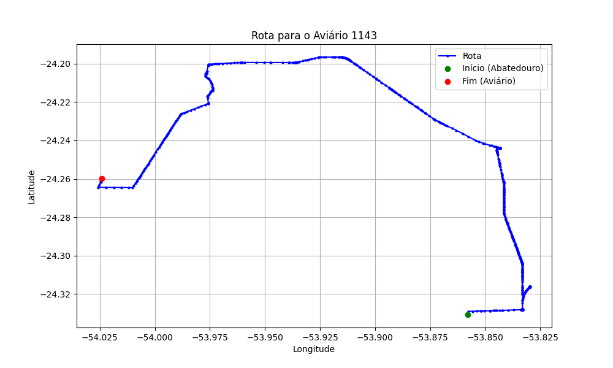

# Relatório de Rota - Aviário 1143

## Informações Gerais
- **Produtor:** CELSO MAERCIO CORDEIRO VILAR
- **Latitude:** -24.259775
- **Longitude:** -54.023211

## Dados da Rota
- **Distância Real:** 39.67 km
- **Tempo Estimado (OSRM):** 57.9 minutos
- **Tempo Estimado (40 km/h):** 59.5 minutos

## Mapa da Rota

[Visualizar Mapa Interativo](mapa_interativo.html)

## Rota até o aviário
1. Saia da rua sem nome, siga por 10m.
2. Vire à direita na Avenida Ariosvaldo Bitencourt, siga por 200m.
3. Siga em frente na Avenida Ariosvaldo Bitencourt, siga por 2,5 km.
4. Vire à esquerda na rua sem nome, siga por 1,5 km.
5. Vire levemente à esquerda na rua sem nome, siga por 660m.
6. Vire em frente na Rodovia Alberto Dalcanale, siga por 1,7 km.
7. New name em frente na Avenida Presidente Kennedy, siga por 7,2 km.
8. Fork levemente à esquerda na rua sem nome, siga por 2,9 km.
9. New name em frente na rua sem nome, siga por 12,3 km.
10. Vire à esquerda na rua sem nome, siga por 600m.
11. Vire à esquerda na Estrada R4, siga por 1,9 km.
12. Siga em frente na Estrada R4, siga por 1,4 km.
13. New name levemente à esquerda na Estrada União, siga por 4,8 km.
14. Vire à direita na Estrada Doutor Dário, siga por 1,6 km.
15. Vire à direita na rua sem nome, siga por 550m.
16. Você chegará ao aviário 1143 à direita.
