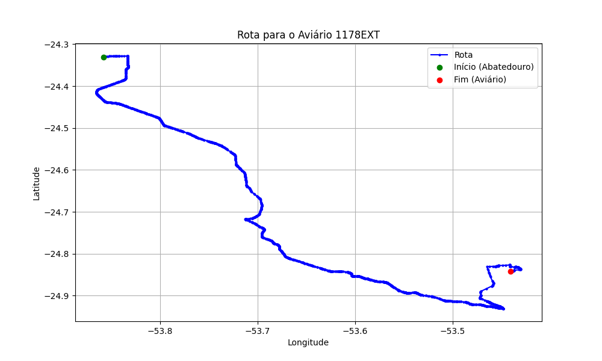

# Relatório de Rota - Aviário 1178EXT

## Informações Gerais
- **Produtor:** PLUMA EDSON OWSIANY
- **Latitude:** -24.84123
- **Longitude:** -53.44094

## Dados da Rota
- **Distância Real:** 112.61 km
- **Tempo Estimado (OSRM):** 104.7 minutos
- **Tempo Estimado (40 km/h):** 168.9 minutos

## Mapa da Rota

[Visualizar Mapa Interativo](mapa_interativo.html)

## Rota até o aviário
1. Saia da rua sem nome, siga por 10m.
2. Vire à direita na Avenida Ariosvaldo Bitencourt, siga por 200m.
3. Siga em frente na Avenida Ariosvaldo Bitencourt, siga por 2,6 km.
4. Vire em frente na Rodovia Alberto Dalcanale, siga por 51,7 km.
5. Siga em frente na rua sem nome, siga por 230m.
6. Siga em frente na Rodovia Perimetral Norte, siga por 90m.
7. New name em frente na Rodovia José Neves Formighieri, siga por 38,6 km.
8. Off ramp levemente à direita na rua sem nome, siga por 500m.
9. Vire em frente na Avenida Barão do Rio Branco, siga por 50m.
10. Siga em frente na Avenida Barão do Rio Branco, siga por 210m.
11. New name em frente na rua sem nome, siga por 12,4 km.
12. Vire à direita na rua sem nome, siga por 3,9 km.
13. Vire à direita na rua sem nome, siga por 770m.
14. Vire à direita na rua sem nome, siga por 1,4 km.
15. Você chegará ao aviário 1178EXT.
