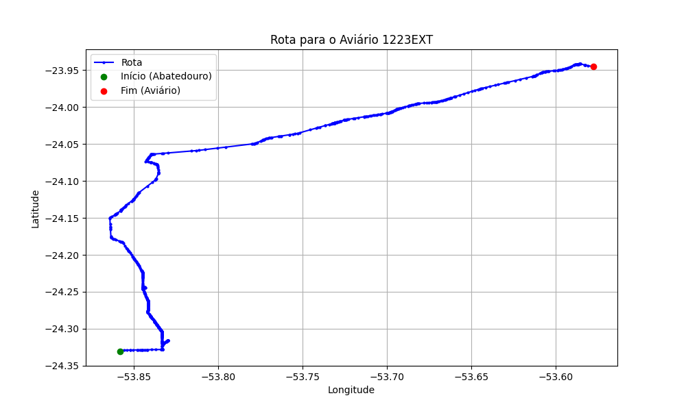

# Relatório de Rota - Aviário 1223EXT

## Informações Gerais
- **Produtor:** PLUSVAL NIVALDO EDER DE SOUZA 02
- **Latitude:** -23.940472
- **Longitude:** -53.567222

## Dados da Rota
- **Distância Real:** 65.95 km
- **Tempo Estimado (OSRM):** 62.8 minutos
- **Tempo Estimado (40 km/h):** 98.9 minutos

## Mapa da Rota

[Visualizar Mapa Interativo](mapa_interativo.html)

## Rota até o aviário
1. Saia da rua sem nome, siga por 10m.
2. Vire à direita na Avenida Ariosvaldo Bitencourt, siga por 200m.
3. Siga em frente na Avenida Ariosvaldo Bitencourt, siga por 2,5 km.
4. Vire à esquerda na rua sem nome, siga por 1,5 km.
5. Vire levemente à esquerda na rua sem nome, siga por 660m.
6. Vire em frente na Rodovia Alberto Dalcanale, siga por 1,7 km.
7. New name em frente na Avenida Presidente Kennedy, siga por 7,2 km.
8. Fork levemente à direita na rua sem nome, siga por 20,3 km.
9. Vire à direita na Avenida Brigadeiro Pamplona Pinto, siga por 1,1 km.
10. Siga em frente na rua sem nome, siga por 130m.
11. Siga em frente na rua sem nome, siga por 12,0 km.
12. Vire levemente à direita na rua sem nome, siga por 140m.
13. Siga em frente na rua sem nome, siga por 60m.
14. Siga em frente na rua sem nome, siga por 17,3 km.
15. Vire à direita na Rua Rio Bom, siga por 110m.
16. Roundabout à direita na rua sem nome, siga por 60m.
17. Exit roundabout à direita na rua sem nome, siga por 130m.
18. Vire à direita na Estrada São Mateus, siga por 390m.
19. End of road à esquerda na Rua Cruzeiro do Sul, siga por 570m.
20. Você chegará ao aviário 1223EXT.
