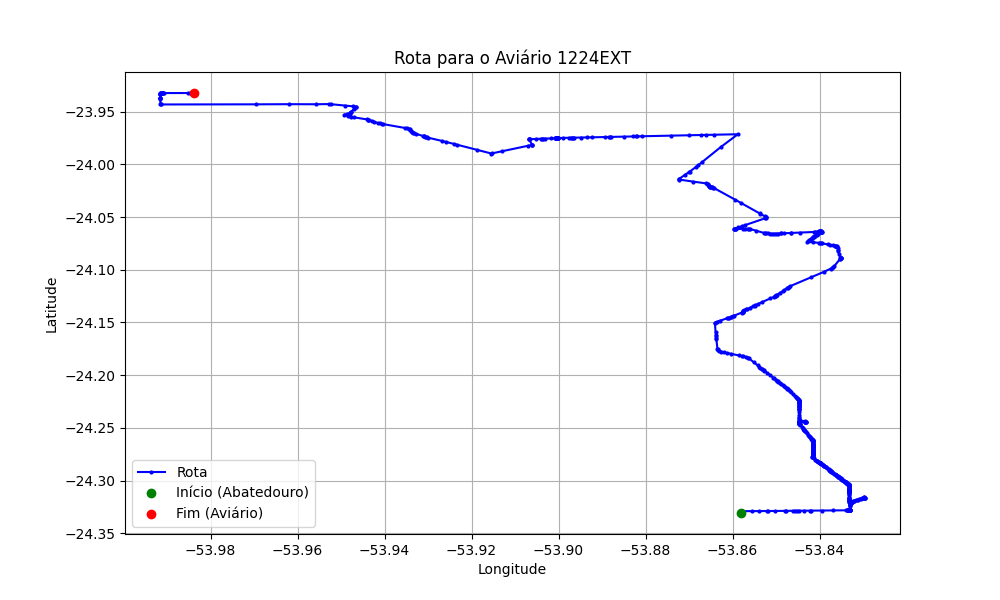

# Relatório de Rota - Aviário 1224EXT

## Informações Gerais
- **Produtor:** PLUSVAL DOMINGOS FEDRIGO NETO 01
- **Latitude:** -23.934194
- **Longitude:** -53.983806

## Dados da Rota
- **Distância Real:** 68.29 km
- **Tempo Estimado (OSRM):** 82.9 minutos
- **Tempo Estimado (40 km/h):** 102.4 minutos

## Mapa da Rota

[Visualizar Mapa Interativo](mapa_interativo.html)

## Rota até o aviário
1. Saia da rua sem nome, siga por 10m.
2. Vire à direita na Avenida Ariosvaldo Bitencourt, siga por 200m.
3. Siga em frente na Avenida Ariosvaldo Bitencourt, siga por 2,5 km.
4. Vire à esquerda na rua sem nome, siga por 1,5 km.
5. Vire levemente à esquerda na rua sem nome, siga por 660m.
6. Vire em frente na Rodovia Alberto Dalcanale, siga por 1,7 km.
7. New name em frente na Avenida Presidente Kennedy, siga por 7,2 km.
8. Fork levemente à direita na rua sem nome, siga por 20,3 km.
9. Vire à direita na Avenida Brigadeiro Pamplona Pinto, siga por 1,2 km.
10. Siga em frente na rua sem nome, siga por 130m.
11. Siga em frente na rua sem nome, siga por 1,0 km.
12. Vire em frente na rua sem nome, siga por 12,1 km.
13. End of road à esquerda na Estrada Nilza, siga por 3,9 km.
14. New name em frente na Avenida Carvalho, siga por 340m.
15. End of road à direita na Avenida Carvalho, siga por 100m.
16. Siga em frente na Avenida Carvalho, siga por 2,5 km.
17. Vire à direita na rua sem nome, siga por 2,4 km.
18. New name em frente na Estrada Figueira, siga por 3,0 km.
19. End of road à direita na Rodovia Iracema Maria Gonçalves Farias, siga por 930m.
20. Vire à esquerda na Estrada Paredão, siga por 5,3 km.
21. New name em frente na Estrada Amendoim, siga por 1,3 km.
22. Você chegará ao aviário 1224EXT à direita.
