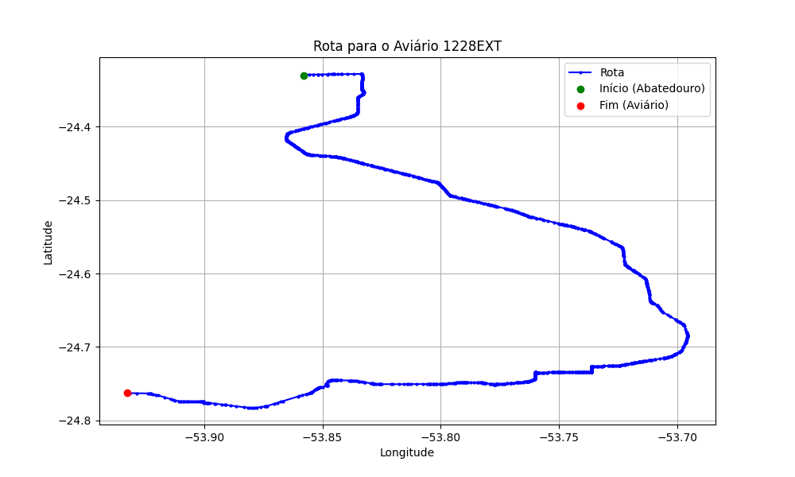

# Relatório de Rota - Aviário 1228EXT

## Informações Gerais
- **Produtor:** PLUMA ANTONIO PONTILI FILHO
- **Latitude:** -24.765995
- **Longitude:** -53.932975

## Dados da Rota
- **Distância Real:** 82.52 km
- **Tempo Estimado (OSRM):** 78.2 minutos
- **Tempo Estimado (40 km/h):** 123.8 minutos

## Mapa da Rota

[Visualizar Mapa Interativo](mapa_interativo.html)

## Rota até o aviário
1. Saia da rua sem nome, siga por 10m.
2. Vire à direita na Avenida Ariosvaldo Bitencourt, siga por 200m.
3. Siga em frente na Avenida Ariosvaldo Bitencourt, siga por 2,6 km.
4. Vire em frente na Rodovia Alberto Dalcanale, siga por 51,8 km.
5. New name em frente na Avenida Parigot de Souza, siga por 330m.
6. Roundabout em frente na Avenida José João Muraro, siga por 50m.
7. Exit roundabout à direita na Avenida José João Muraro, siga por 990m.
8. Roundabout à direita na Avenida José João Muraro, siga por 20m.
9. Exit roundabout levemente à direita na Avenida José João Muraro, siga por 1,2 km.
10. Roundabout à direita na Rua São João, siga por 50m.
11. Exit roundabout em frente na Rua São João, siga por 820m.
12. Roundabout levemente à direita na Avenida Maripá, siga por 10m.
13. Exit roundabout à direita na Avenida Maripá, siga por 2,4 km.
14. Roundabout levemente à direita na Avenida Ministro Cirne Lima, siga por 80m.
15. Exit roundabout à direita na Avenida Ministro Cirne Lima, siga por 1,3 km.
16. New name em frente na Rodovia Doutor Ivo Rocha, siga por 16,5 km.
17. New name em frente na Rua Curitiba, siga por 300m.
18. Vire à direita na Rua Paraíba, siga por 200m.
19. Vire à esquerda na Avenida Belo Horizonte, siga por 680m.
20. Vire à esquerda na Rua Venezuela, siga por 80m.
21. Vire levemente à direita na Avenida Brasil, siga por 3,0 km.
22. Você chegará ao aviário 1228EXT.
