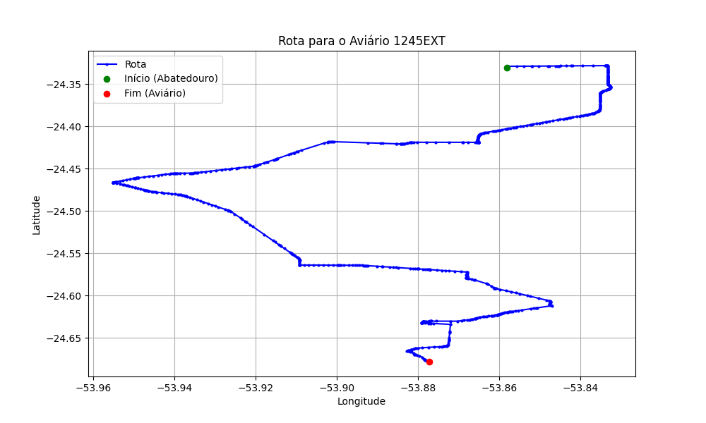

# Relatório de Rota - Aviário 1245EXT

## Informações Gerais
- **Produtor:** PLUMA OSMAR SCHENEIDER 03
- **Latitude:** -24.677763
- **Longitude:** -53.876703

## Dados da Rota
- **Distância Real:** 57.99 km
- **Tempo Estimado (OSRM):** 72.1 minutos
- **Tempo Estimado (40 km/h):** 87.0 minutos

## Mapa da Rota

[Visualizar Mapa Interativo](mapa_interativo.html)

## Rota até o aviário
1. Saia da rua sem nome, siga por 10m.
2. Vire à direita na Avenida Ariosvaldo Bitencourt, siga por 200m.
3. Siga em frente na Avenida Ariosvaldo Bitencourt, siga por 2,6 km.
4. Vire em frente na Rodovia Alberto Dalcanale, siga por 11,1 km.
5. Siga em frente na rua sem nome, siga por 60m.
6. Vire levemente à direita na rua sem nome, siga por 2,0 km.
7. Vire em frente na rua sem nome, siga por 1,8 km.
8. Vire em frente na rua sem nome, siga por 8,0 km.
9. Vire à esquerda na rua sem nome, siga por 20m.
10. Vire à direita na Avenida Horizontina, siga por 1,2 km.
11. New name em frente na Rodovia Prefeito Daniel Wutzke, siga por 10,9 km.
12. Vire à esquerda na Avenida Marechal Castelo Branco, siga por 3,3 km.
13. Vire levemente à direita na Estrada do Distrito São Miguel, siga por 1,0 km.
14. Siga em frente na Estrada do Distrito São Miguel, siga por 5,1 km.
15. Vire à direita na rua sem nome, siga por 3,9 km.
16. New name em frente na Rua Tomé de Souza, siga por 110m.
17. Vire à direita na Avenida Presidente Costa e Silva, siga por 100m.
18. Vire à esquerda na Rua Nossa Senhora de Fátima, siga por 180m.
19. Siga em frente na Acesso à Rodovia Doutor Ernesto Dall´ Óglio, siga por 310m.
20. Siga em frente na Rodovia Doutor Ernesto Dall´ Óglio, siga por 450m.
21. Vire à direita na rua sem nome, siga por 2,8 km.
22. Vire à direita na rua sem nome, siga por 1,3 km.
23. Vire à esquerda na Linha Santa Terezinha, siga por 1,5 km.
24. Você chegará ao aviário 1245EXT à esquerda.
