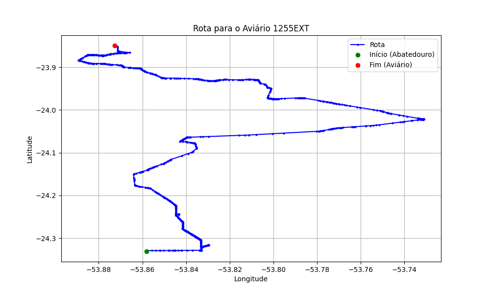

# Relatório de Rota - Aviário 1255EXT

## Informações Gerais
- **Produtor:** BELLO VANESSA MICHELI ARAUJO 02
- **Latitude:** -23.849361
- **Longitude:** -53.872944

## Dados da Rota
- **Distância Real:** 79.16 km
- **Tempo Estimado (OSRM):** 80.4 minutos
- **Tempo Estimado (40 km/h):** 118.7 minutos

## Mapa da Rota

[Visualizar Mapa Interativo](mapa_interativo.html)

## Rota até o aviário
1. Saia da rua sem nome, siga por 10m.
2. Vire à direita na Avenida Ariosvaldo Bitencourt, siga por 200m.
3. Siga em frente na Avenida Ariosvaldo Bitencourt, siga por 2,5 km.
4. Vire à esquerda na rua sem nome, siga por 1,5 km.
5. Vire levemente à esquerda na rua sem nome, siga por 660m.
6. Vire em frente na Rodovia Alberto Dalcanale, siga por 1,7 km.
7. New name em frente na Avenida Presidente Kennedy, siga por 7,2 km.
8. Fork levemente à direita na rua sem nome, siga por 20,3 km.
9. Vire à direita na Avenida Brigadeiro Pamplona Pinto, siga por 1,1 km.
10. Siga em frente na rua sem nome, siga por 130m.
11. Siga em frente na rua sem nome, siga por 12,0 km.
12. Vire levemente à direita na rua sem nome, siga por 190m.
13. Fork levemente à direita na rua sem nome, siga por 70m.
14. New name em frente na rua sem nome, siga por 25,8 km.
15. Vire à direita na Rua Marechal Arthur da Costa e Silva, siga por 1,4 km.
16. Vire levemente à direita na Avenida Brasil, siga por 70m.
17. Roundabout em frente na PR-496, siga por 10m.
18. Exit roundabout em frente na PR-496, siga por 2,3 km.
19. Vire à esquerda na Estrada Cayena, siga por 2,1 km.
20. Você chegará ao aviário 1255EXT à esquerda.
