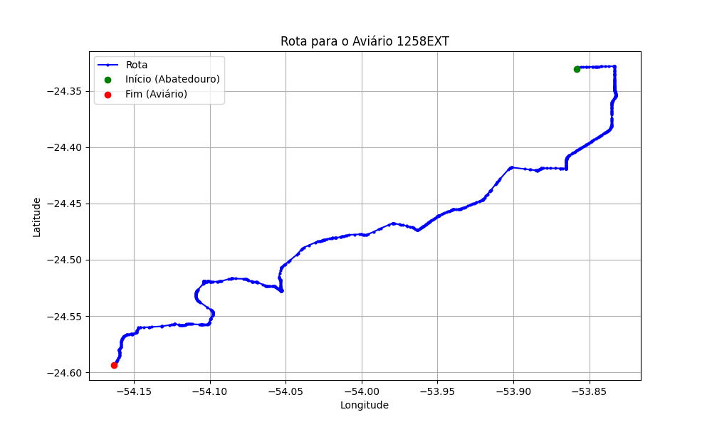

# Relatório de Rota - Aviário 1258EXT

## Informações Gerais
- **Produtor:** PLUMA GILBERTO DANIEL OSWALD 01
- **Latitude:** -24.593639
- **Longitude:** -54.162528

## Dados da Rota
- **Distância Real:** 59.79 km
- **Tempo Estimado (OSRM):** 66.1 minutos
- **Tempo Estimado (40 km/h):** 89.7 minutos

## Mapa da Rota

[Visualizar Mapa Interativo](mapa_interativo.html)

## Rota até o aviário
1. Saia da rua sem nome, siga por 10m.
2. Vire à direita na Avenida Ariosvaldo Bitencourt, siga por 200m.
3. Siga em frente na Avenida Ariosvaldo Bitencourt, siga por 2,6 km.
4. Vire em frente na Rodovia Alberto Dalcanale, siga por 11,1 km.
5. Siga em frente na rua sem nome, siga por 60m.
6. Vire levemente à direita na rua sem nome, siga por 2,0 km.
7. Vire em frente na rua sem nome, siga por 1,8 km.
8. Vire em frente na rua sem nome, siga por 10,9 km.
9. Vire em frente na rua sem nome, siga por 11,5 km.
10. Roundabout à direita na rua sem nome, siga por 10m.
11. Exit roundabout levemente à direita na rua sem nome, siga por 300m.
12. Siga em frente na rua sem nome, siga por 4,8 km.
13. Off ramp levemente à direita na rua sem nome, siga por 230m.
14. New name em frente na Contorno de Marechal Cândido Rondon, siga por 270m.
15. Siga em frente na Contorno de Marechal Cândido Rondon, siga por 40m.
16. Siga em frente na Contorno de Marechal Cândido Rondon, siga por 4,6 km.
17. Vire em frente na rua sem nome, siga por 300m.
18. Vire em frente na rua sem nome, siga por 4,6 km.
19. Vire à esquerda na rua sem nome, siga por 500m.
20. Vire à direita na rua sem nome, siga por 700m.
21. Vire à esquerda na rua sem nome, siga por 3,3 km.
22. Você chegará ao aviário 1258EXT à esquerda.
