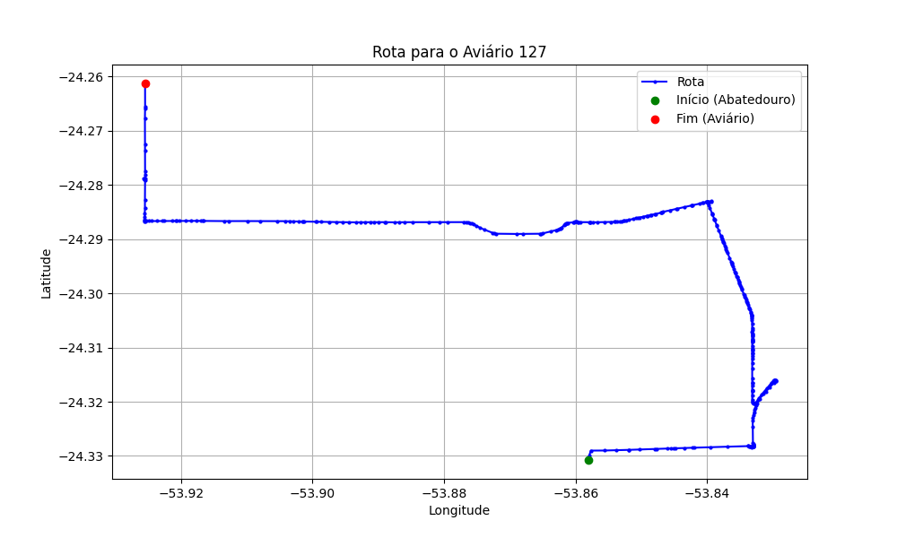

# Relatório de Rota - Aviário 127

## Informações Gerais
- **Produtor:** LUIZ LUSSANI
- **Latitude:** -24.261278
- **Longitude:** -53.907806

## Dados da Rota
- **Distância Real:** 20.84 km
- **Tempo Estimado (OSRM):** 59.2 minutos
- **Tempo Estimado (40 km/h):** 31.3 minutos

## Mapa da Rota

[Visualizar Mapa Interativo](mapa_interativo.html)

## Rota até o aviário
1. Saia da rua sem nome, siga por 10m.
2. Vire à direita na Avenida Ariosvaldo Bitencourt, siga por 200m.
3. Siga em frente na Avenida Ariosvaldo Bitencourt, siga por 2,5 km.
4. Vire à esquerda na rua sem nome, siga por 1,5 km.
5. Vire levemente à esquerda na rua sem nome, siga por 660m.
6. Vire em frente na Rodovia Alberto Dalcanale, siga por 1,7 km.
7. New name em frente na Avenida Presidente Kennedy, siga por 2,4 km.
8. Vire à direita na Avenida Independência, siga por 60m.
9. Siga em frente na Avenida Independência, siga por 800m.
10. New name em frente na rua sem nome, siga por 1,4 km.
11. Vire à esquerda na rua sem nome, siga por 6,8 km.
12. Vire à direita na KD 134, siga por 850m.
13. Vire à esquerda na rua sem nome, siga por 50m.
14. Vire à esquerda na KD 134, siga por 1,9 km.
15. Você chegará ao aviário 127.
