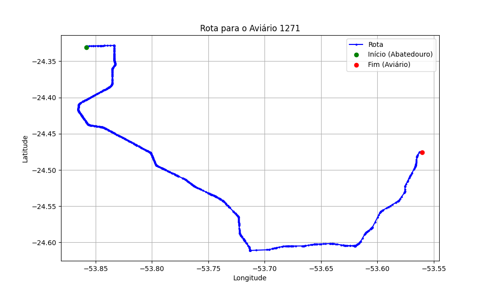

# Relatório de Rota - Aviário 1271

## Informações Gerais
- **Produtor:** ERASMO BERGAMIN
- **Latitude:** -24.476256
- **Longitude:** -53.560506

## Dados da Rota
- **Distância Real:** 67.42 km
- **Tempo Estimado (OSRM):** 59.1 minutos
- **Tempo Estimado (40 km/h):** 101.1 minutos

## Mapa da Rota

[Visualizar Mapa Interativo](mapa_interativo.html)

## Rota até o aviário
1. Saia da rua sem nome, siga por 10m.
2. Vire à direita na Avenida Ariosvaldo Bitencourt, siga por 200m.
3. Siga em frente na Avenida Ariosvaldo Bitencourt, siga por 2,6 km.
4. Vire em frente na Rodovia Alberto Dalcanale, siga por 38,7 km.
5. Vire levemente à esquerda na rua sem nome, siga por 130m.
6. Vire à esquerda na rua sem nome, siga por 9,6 km.
7. Fork levemente à esquerda na rua sem nome, siga por 15,9 km.
8. Vire à direita na rua sem nome, siga por 230m.
9. Você chegará ao aviário 1271 à direita.
