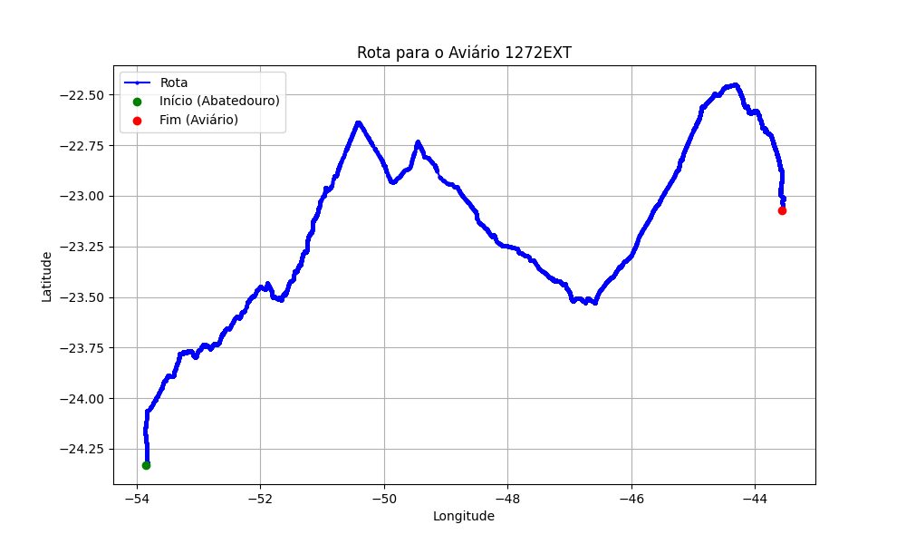

# Relatório de Rota - Aviário 1272EXT

## Informações Gerais
- **Produtor:** PLUSVAL MARCELO MARTINS 02
- **Latitude:** -23.832833
- **Longitude:** -43.332916

## Dados da Rota
- **Distância Real:** 1321.25 km
- **Tempo Estimado (OSRM):** 1003.5 minutos
- **Tempo Estimado (40 km/h):** 1981.9 minutos

## Mapa da Rota

[Visualizar Mapa Interativo](mapa_interativo.html)

## Rota até o aviário
1. Saia da rua sem nome, siga por 10m.
2. Vire à direita na Avenida Ariosvaldo Bitencourt, siga por 200m.
3. Siga em frente na Avenida Ariosvaldo Bitencourt, siga por 2,5 km.
4. Vire à esquerda na rua sem nome, siga por 1,5 km.
5. Vire levemente à esquerda na rua sem nome, siga por 660m.
6. Vire em frente na Rodovia Alberto Dalcanale, siga por 1,7 km.
7. New name em frente na Avenida Presidente Kennedy, siga por 7,2 km.
8. Fork levemente à direita na rua sem nome, siga por 20,3 km.
9. Vire à direita na Avenida Brigadeiro Pamplona Pinto, siga por 1,1 km.
10. Siga em frente na rua sem nome, siga por 130m.
11. Siga em frente na rua sem nome, siga por 12,0 km.
12. Vire levemente à direita na rua sem nome, siga por 140m.
13. Siga em frente na rua sem nome, siga por 60m.
14. Siga em frente na rua sem nome, siga por 23,7 km.
15. Vire em frente na rua sem nome, siga por 55,7 km.
16. Rotary em frente na PR-323, siga por 60m.
17. Exit rotary em frente na PR-323, siga por 320m.
18. Siga em frente na rua sem nome, siga por 3,4 km.
19. Siga em frente na rua sem nome, siga por 110m.
20. Fork levemente à esquerda na rua sem nome, siga por 50m.
21. Siga em frente na rua sem nome, siga por 116,7 km.
22. Fork levemente à esquerda na Rodovia Silvino Fernandes Dias, siga por 7,1 km.
23. Off ramp levemente à direita na rua sem nome, siga por 340m.
24. Siga em frente na Rodovia da Moda, siga por 230m.
25. Rotary em frente na Anel Viário Prefeito Sincler Sambatti, siga por 130m.
26. Exit rotary à direita na Anel Viário Prefeito Sincler Sambatti, siga por 1,0 km.
27. Roundabout em frente na Anel Viário Prefeito Sincler Sambatti, siga por 50m.
28. Exit roundabout em frente na Anel Viário Prefeito Sincler Sambatti, siga por 2,4 km.
29. Rotary levemente à direita na Anel Viário Prefeito Sincler Sambatti, siga por 70m.
30. Exit rotary à direita na Anel Viário Prefeito Sincler Sambatti, siga por 1,1 km.
31. Roundabout em frente na Anel Viário Prefeito Sincler Sambatti, siga por 40m.
32. Exit roundabout em frente na Anel Viário Prefeito Sincler Sambatti, siga por 4,2 km.
33. Roundabout levemente à direita na Anel Viário Prefeito Sincler Sambatti, siga por 70m.
34. Exit roundabout em frente na Anel Viário Prefeito Sincler Sambatti, siga por 2,9 km.
35. Vire à direita na Avenida Colombo, siga por 230m.
36. Off ramp em frente na Avenida Colombo, siga por 240m.
37. New name em frente na Rodovia do Café Governador Ney Braga, siga por 20,5 km.
38. Fork levemente à esquerda na Rodovia do Café Governador Ney Braga, siga por 1,5 km.
39. New name em frente na Rodovia Hermínio Antônio Pennacchi, siga por 21,0 km.
40. Siga em frente na Rodovia Hermínio Antônio Pennacchi, siga por 18,2 km.
41. Siga em frente na Rodovia Paulo Walmor Kummel, siga por 3,3 km.
42. Vire em frente na rua sem nome, siga por 10,0 km.
43. Siga em frente na rua sem nome, siga por 60m.
44. Vire levemente à esquerda na rua sem nome, siga por 380m.
45. New name em frente na Avenida José Bonifacio, siga por 4,0 km.
46. New name levemente à direita na Rua Belo Horizonte, siga por 1,2 km.
47. Roundabout em frente na Rua Belo Horizonte, siga por 10m.
48. Exit roundabout em frente na Rua Belo Horizonte, siga por 650m.
49. Roundabout à direita na Avenida Roberto Conceição, siga por 80m.
50. Exit roundabout à direita na Avenida Roberto Conceição, siga por 120m.
51. Vire à esquerda na Rua Carlos Sawade, siga por 360m.
52. Roundabout em frente na Rua Xavantes, siga por 0m.
53. Exit roundabout à direita na Rua Xavantes, siga por 490m.
54. New name em frente na Avenida Antônio Raminelli, siga por 930m.
55. Roundabout à direita na Avenida Antônio Raminelli, siga por 160m.
56. Exit roundabout à direita na Avenida Antônio Raminelli, siga por 590m.
57. Vire à esquerda na rua sem nome, siga por 330m.
58. Siga em frente na rua sem nome, siga por 120m.
59. Siga em frente na Rodovia Celso Garcia Cid, siga por 28,3 km.
60. Off ramp levemente à direita na rua sem nome, siga por 190m.
61. Siga em frente na Rodovia Celso Garcia Cid, siga por 33,6 km.
62. Vire em frente na rua sem nome, siga por 420m.
63. Siga em frente na Rodovia Celso Garcia Cid, siga por 8,1 km.
64. New name em frente na Ponte sobre o Rio Paranapanema, siga por 660m.
65. New name em frente na Rodovia Miguel Jubran, siga por 46,8 km.
66. Siga em frente na Rodovia Miguel Jubran, siga por 40m.
67. Off ramp levemente à direita na rua sem nome, siga por 530m.
68. Siga em frente na Rodovia Raposo Tavares, siga por 64,7 km.
69. New name em frente na Rodovia Orlando Quagliato, siga por 33,2 km.
70. New name em frente na Rodovia Engenheiro João Baptista Cabral Rennó, siga por 18,6 km.
71. Off ramp levemente à direita na rua sem nome, siga por 650m.
72. Siga em frente na Rodovia Presidente Castelo Branco, siga por 301,4 km.
73. New name em frente na Complexo Viário Heróis de 1932, siga por 500m.
74. New name em frente na Acesso Marginal Tietê Central, siga por 330m.
75. Siga em frente na Marginal Tietê (Central), siga por 190m.
76. New name em frente na Avenida Marginal Tietê, siga por 120m.
77. New name em frente na Marginal Tietê Central, siga por 120m.
78. Off ramp levemente à esquerda na rua sem nome, siga por 130m.
79. New name em frente na Marginal Tietê  (Expressa), siga por 470m.
80. New name em frente na Marginal Tietê (Expressa), siga por 2,7 km.
81. Fork levemente à esquerda na Marginal Tietê (Expressa), siga por 8,8 km.
82. Fork levemente à esquerda na Marginal Tietê (Expressa), siga por 4,3 km.
83. Fork levemente à esquerda na Rodovia Presidente Dutra, siga por 54,5 km.
84. Fork levemente à direita na rua sem nome, siga por 120m.
85. Siga em frente na Rodovia Presidente Dutra, siga por 31,8 km.
86. Off ramp levemente à direita na rua sem nome, siga por 70m.
87. New name em frente na Avenida Pedro Friggi, siga por 130m.
88. Fork levemente à esquerda na Avenida Pedro Friggi, siga por 100m.
89. Fork levemente à esquerda na Avenida Pedro Friggi, siga por 1,8 km.
90. Fork levemente à esquerda na Avenida Pedro Friggi, siga por 320m.
91. Siga em frente na Rodovia Presidente Dutra, siga por 192,9 km.
92. Siga em frente na Rodovia Presidente Dutra, siga por 11,2 km.
93. Fork levemente à esquerda na Rodovia Presidente Dutra, siga por 64,1 km.
94. Off ramp levemente à direita na rua sem nome, siga por 560m.
95. Siga em frente na Rodovia Luiz Henrique Rezende Novaes, siga por 21,8 km.
96. Siga em frente na Rodovia Luiz Henrique Rezende Novaes, siga por 750m.
97. New name em frente na Estrada Rio-São Paulo, siga por 4,4 km.
98. Vire levemente à direita na Rua Vitor Alves, siga por 840m.
99. Vire à direita na Estrada do Rio do A, siga por 580m.
100. New name em frente na Viaduto Prefeito Alim Pedro, siga por 520m.
101. Fork levemente à esquerda na Mergulhão de Campo Grande, siga por 420m.
102. Vire em frente na Estrada do Monteiro, siga por 3,3 km.
103. New name em frente na Estrada do Magarça, siga por 350m.
104. Vire levemente à esquerda na Rua Campo Formoso, siga por 1,1 km.
105. New name em frente na Estrada do Mato Alto, siga por 4,8 km.
106. Roundabout levemente à direita na Estrada do Mato Alto, siga por 80m.
107. Exit roundabout levemente à direita na Estrada do Mato Alto, siga por 1,6 km.
108. Roundabout em frente na rua sem nome, siga por 40m.
109. Exit roundabout em frente na rua sem nome, siga por 320m.
110. Siga em frente na Avenida Dom João VI, siga por 260m.
111. Off ramp acentuadamente à esquerda na rua sem nome, siga por 50m.
112. Siga em frente na Avenida Dom João VI, siga por 4,4 km.
113. Off ramp levemente à direita na rua sem nome, siga por 480m.
114. Siga em frente na Avenida Dom João VI, siga por 780m.
115. Vire levemente à direita na Avenida Artur Xexéo, siga por 920m.
116. Vire à direita na Estrada Roberto Burle Marx, siga por 9,3 km.
117. Vire à esquerda na Estrada Parlon Siqueira, siga por 510m.
118. Vire à esquerda na rua sem nome, siga por 80m.
119. Você chegará ao aviário 1272EXT.
