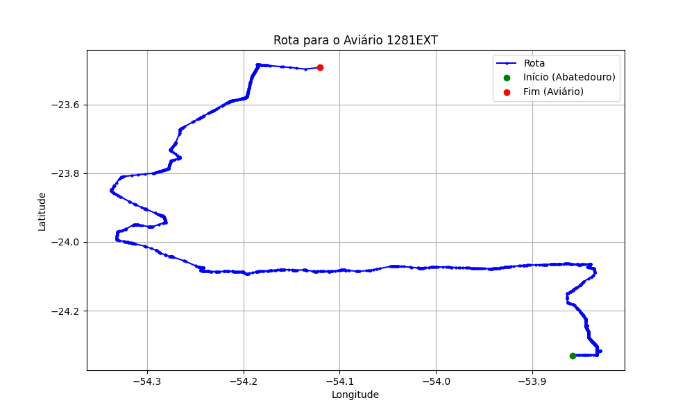

# Relatório de Rota - Aviário 1281EXT

## Informações Gerais
- **Produtor:** BELLO JOSE GUILLERME PASSARINE 02
- **Latitude:** -23.492277
- **Longitude:** -54.120611

## Dados da Rota
- **Distância Real:** 168.02 km
- **Tempo Estimado (OSRM):** 165.3 minutos
- **Tempo Estimado (40 km/h):** 252.0 minutos

## Mapa da Rota

[Visualizar Mapa Interativo](mapa_interativo.html)

## Rota até o aviário
1. Saia da rua sem nome, siga por 10m.
2. Vire à direita na Avenida Ariosvaldo Bitencourt, siga por 200m.
3. Siga em frente na Avenida Ariosvaldo Bitencourt, siga por 2,5 km.
4. Vire à esquerda na rua sem nome, siga por 1,5 km.
5. Vire levemente à esquerda na rua sem nome, siga por 660m.
6. Vire em frente na Rodovia Alberto Dalcanale, siga por 1,7 km.
7. New name em frente na Avenida Presidente Kennedy, siga por 7,2 km.
8. Fork levemente à direita na rua sem nome, siga por 20,3 km.
9. Vire à direita na Avenida Brigadeiro Pamplona Pinto, siga por 1,2 km.
10. Siga em frente na rua sem nome, siga por 130m.
11. Siga em frente na rua sem nome, siga por 37,7 km.
12. Vire à direita na rua sem nome, siga por 50m.
13. New name em frente na Avenida Roland, siga por 680m.
14. Roundabout em frente na Avenida Brasil, siga por 110m.
15. Exit roundabout em frente na Avenida Brasil, siga por 390m.
16. New name em frente na Avenida Martin Luther King, siga por 1,2 km.
17. Roundabout à direita na Avenida Martin Luther King, siga por 100m.
18. Exit roundabout à direita na Avenida Martin Luther King, siga por 330m.
19. Roundabout à direita na Avenida Martin Luther King, siga por 110m.
20. Exit roundabout à direita na Avenida Martin Luther King, siga por 1,7 km.
21. Roundabout à direita na Avenida Martin Luther King, siga por 30m.
22. Exit roundabout à direita na Avenida Martin Luther King, siga por 780m.
23. Rotary à direita na Avenida Almirante Tamandaré, siga por 90m.
24. Exit rotary à direita na Avenida Almirante Tamandaré, siga por 920m.
25. Roundabout em frente na rua sem nome, siga por 100m.
26. Exit roundabout em frente na rua sem nome, siga por 24,8 km.
27. Roundabout em frente na Rodovia BR-163, siga por 40m.
28. Exit roundabout levemente à direita na Rodovia BR-163, siga por 20,1 km.
29. Roundabout em frente na rua sem nome, siga por 50m.
30. Exit roundabout em frente na rua sem nome, siga por 36,5 km.
31. Vire à direita na Avenida Treze de Maio, siga por 730m.
32. End of road à esquerda na Avenida Treze de Maio, siga por 10m.
33. Siga em frente na Avenida Treze de Maio, siga por 720m.
34. New name em frente na rua sem nome, siga por 3,9 km.
35. Vire levemente à esquerda na rua sem nome, siga por 1,6 km.
36. Você chegará ao aviário 1281EXT à esquerda.
