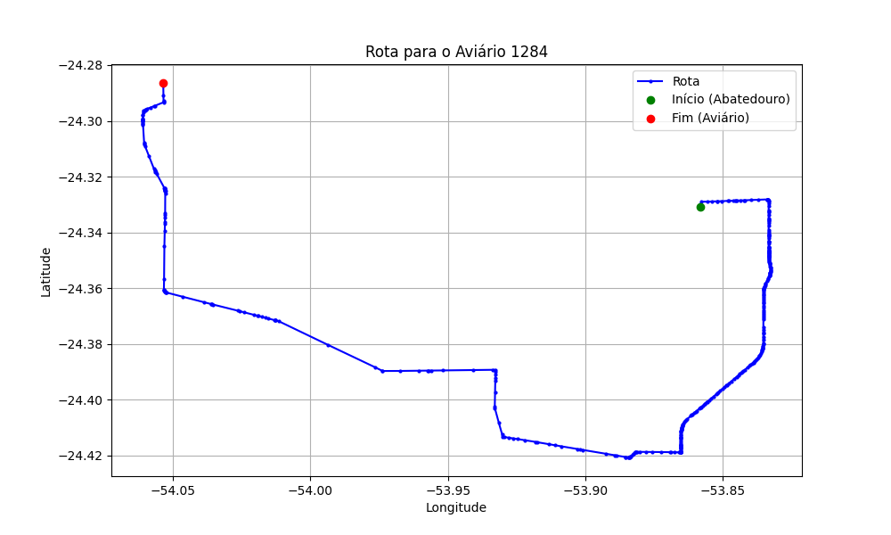

# Relatório de Rota - Aviário 1284

## Informações Gerais
- **Produtor:** JAIME BASSO
- **Latitude:** -24.286383
- **Longitude:** -54.050872

## Dados da Rota
- **Distância Real:** 45.31 km
- **Tempo Estimado (OSRM):** 48.4 minutos
- **Tempo Estimado (40 km/h):** 68.0 minutos

## Mapa da Rota

[Visualizar Mapa Interativo](mapa_interativo.html)

## Rota até o aviário
1. Saia da rua sem nome, siga por 10m.
2. Vire à direita na Avenida Ariosvaldo Bitencourt, siga por 200m.
3. Siga em frente na Avenida Ariosvaldo Bitencourt, siga por 2,6 km.
4. Vire em frente na Rodovia Alberto Dalcanale, siga por 11,1 km.
5. Siga em frente na rua sem nome, siga por 60m.
6. Vire levemente à direita na rua sem nome, siga por 2,0 km.
7. Vire em frente na rua sem nome, siga por 1,8 km.
8. Vire em frente na rua sem nome, siga por 3,0 km.
9. Vire à direita na rua sem nome, siga por 2,7 km.
10. End of road à esquerda na rua sem nome, siga por 4,2 km.
11. Vire levemente à direita na rua sem nome, siga por 16,1 km.
12. Vire à direita na Rua Dez, siga por 80m.
13. Vire à esquerda na Avenida Paraná, siga por 40m.
14. Vire à direita na rua sem nome, siga por 390m.
15. New name em frente na Estrada União, siga por 340m.
16. Vire à esquerda na rua sem nome, siga por 770m.
17. Você chegará ao aviário 1284 à direita.
