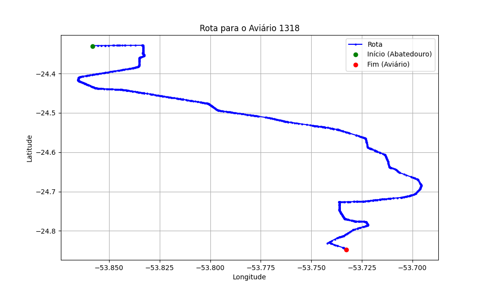

# Relatório de Rota - Aviário 1318

## Informações Gerais
- **Produtor:** MARCEL GILVAN LEONARDI
- **Latitude:** -24.848775
- **Longitude:** -53.737206

## Dados da Rota
- **Distância Real:** 71.94 km
- **Tempo Estimado (OSRM):** 78.4 minutos
- **Tempo Estimado (40 km/h):** 107.9 minutos

## Mapa da Rota

[Visualizar Mapa Interativo](mapa_interativo.html)

## Rota até o aviário
1. Saia da rua sem nome, siga por 10m.
2. Vire à direita na Avenida Ariosvaldo Bitencourt, siga por 200m.
3. Siga em frente na Avenida Ariosvaldo Bitencourt, siga por 2,6 km.
4. Vire em frente na Rodovia Alberto Dalcanale, siga por 51,8 km.
5. New name em frente na Avenida Parigot de Souza, siga por 330m.
6. Roundabout em frente na Avenida José João Muraro, siga por 50m.
7. Exit roundabout à direita na Avenida José João Muraro, siga por 990m.
8. Roundabout à direita na Avenida José João Muraro, siga por 20m.
9. Exit roundabout levemente à direita na Avenida José João Muraro, siga por 1,2 km.
10. Roundabout à direita na Rua São João, siga por 50m.
11. Exit roundabout em frente na Rua São João, siga por 820m.
12. Roundabout levemente à direita na Avenida Senador Atílio Fontana, siga por 20m.
13. Exit roundabout levemente à direita na Avenida Senador Atílio Fontana, siga por 2,3 km.
14. Roundabout levemente à direita na Avenida Senador Atílio Fontana, siga por 40m.
15. Exit roundabout à direita na Avenida Senador Atílio Fontana, siga por 4,5 km.
16. New name em frente na Estrada Rural para Toledo, siga por 3,1 km.
17. New name em frente na Linha Mandarina, siga por 1,8 km.
18. Vire à esquerda na rua sem nome, siga por 200m.
19. Fork levemente à direita na rua sem nome, siga por 1,9 km.
20. Você chegará ao aviário 1318.
