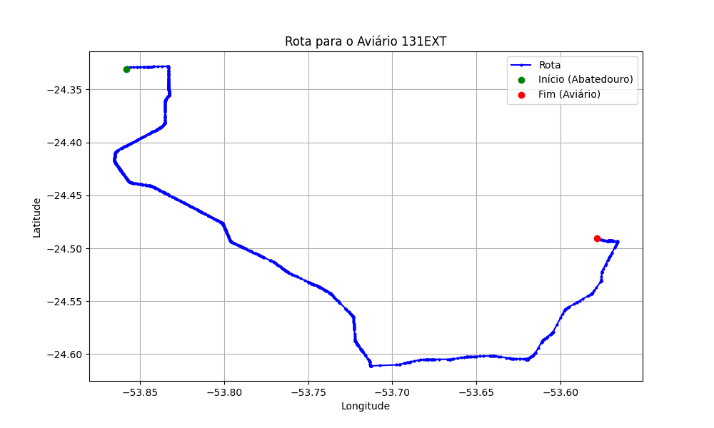

# Relatório de Rota - Aviário 131EXT

## Informações Gerais
- **Produtor:** PLUMA CLAUDEMIR TEZOLIN1
- **Latitude:** -24.490822
- **Longitude:** -53.579255

## Dados da Rota
- **Distância Real:** 66.66 km
- **Tempo Estimado (OSRM):** 64.5 minutos
- **Tempo Estimado (40 km/h):** 100.0 minutos

## Mapa da Rota

[Visualizar Mapa Interativo](mapa_interativo.html)

## Rota até o aviário
1. Saia da rua sem nome, siga por 10m.
2. Vire à direita na Avenida Ariosvaldo Bitencourt, siga por 200m.
3. Siga em frente na Avenida Ariosvaldo Bitencourt, siga por 2,6 km.
4. Vire em frente na Rodovia Alberto Dalcanale, siga por 38,7 km.
5. Vire levemente à esquerda na rua sem nome, siga por 130m.
6. Vire à esquerda na rua sem nome, siga por 9,6 km.
7. Fork levemente à esquerda na rua sem nome, siga por 13,8 km.
8. Vire à esquerda na Avenida Brasil, siga por 340m.
9. Vire à direita na Avenida Tiradentes, siga por 70m.
10. Vire à esquerda na Travessa dos Inconfidentes, siga por 190m.
11. Vire à direita na rua sem nome, siga por 970m.
12. Você chegará ao aviário 131EXT à esquerda.
