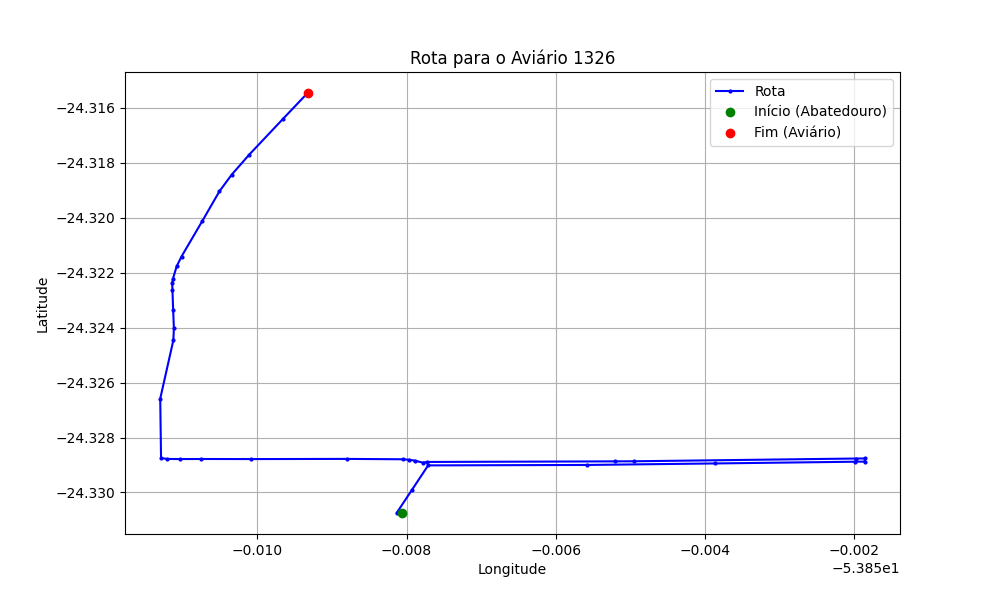

# Relatório de Rota - Aviário 1326

## Informações Gerais
- **Produtor:** CLAUCIR GRIS
- **Latitude:** -24.315664
- **Longitude:** -53.858639

## Dados da Rota
- **Distância Real:** 3.27 km
- **Tempo Estimado (OSRM):** 29.4 minutos
- **Tempo Estimado (40 km/h):** 4.9 minutos

## Mapa da Rota

[Visualizar Mapa Interativo](mapa_interativo.html)

## Rota até o aviário
1. Saia da rua sem nome, siga por 10m.
2. Vire à direita na Avenida Ariosvaldo Bitencourt, siga por 200m.
3. Siga em frente na Avenida Ariosvaldo Bitencourt, siga por 590m.
4. Siga em frente na Avenida Ariosvaldo Bitencourt, siga por 610m.
5. Vire à direita na rua sem nome, siga por 1,9 km.
6. Você chegará ao aviário 1326 à direita.
