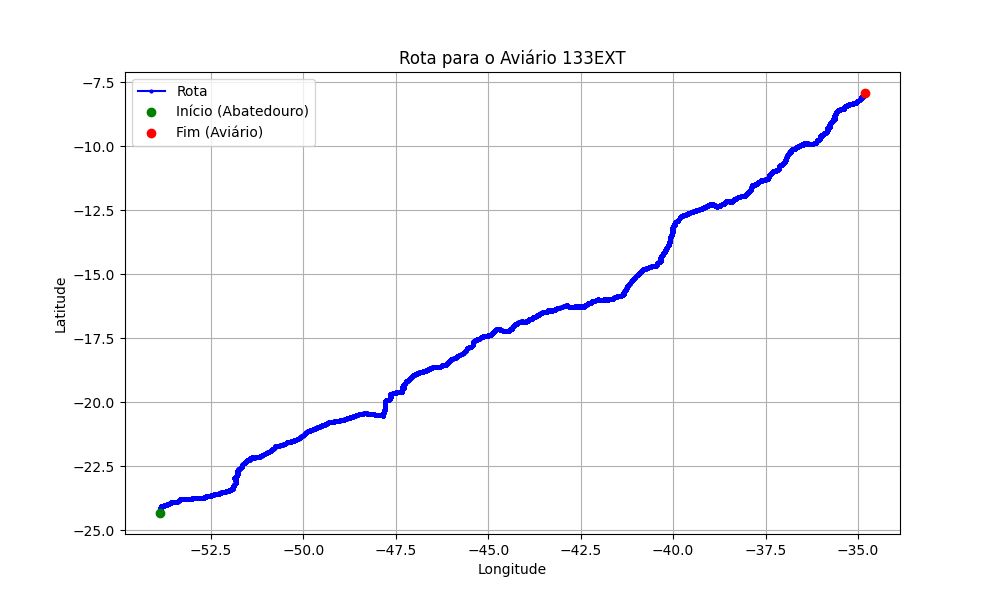

# Relatório de Rota - Aviário 133EXT

## Informações Gerais
- **Produtor:** PLUMA CRISTIANO PARIZZI2
- **Latitude:** -24.639528
- **Longitude:** 53.596494

## Dados da Rota
- **Distância Real:** 3267.19 km
- **Tempo Estimado (OSRM):** 2634.7 minutos
- **Tempo Estimado (40 km/h):** 4900.8 minutos

## Mapa da Rota

[Visualizar Mapa Interativo](mapa_interativo.html)

## Rota até o aviário
1. Saia da rua sem nome, siga por 10m.
2. Vire à direita na Avenida Ariosvaldo Bitencourt, siga por 200m.
3. Siga em frente na Avenida Ariosvaldo Bitencourt, siga por 2,5 km.
4. Vire à esquerda na rua sem nome, siga por 1,5 km.
5. Vire levemente à esquerda na rua sem nome, siga por 660m.
6. Vire em frente na Rodovia Alberto Dalcanale, siga por 1,7 km.
7. New name em frente na Avenida Presidente Kennedy, siga por 7,2 km.
8. Fork levemente à direita na rua sem nome, siga por 20,3 km.
9. Vire à direita na Avenida Brigadeiro Pamplona Pinto, siga por 1,1 km.
10. Siga em frente na rua sem nome, siga por 130m.
11. Siga em frente na rua sem nome, siga por 12,0 km.
12. Vire levemente à direita na rua sem nome, siga por 140m.
13. Siga em frente na rua sem nome, siga por 60m.
14. Siga em frente na rua sem nome, siga por 23,7 km.
15. Vire em frente na rua sem nome, siga por 55,7 km.
16. Rotary em frente na PR-323, siga por 60m.
17. Exit rotary em frente na PR-323, siga por 320m.
18. Siga em frente na rua sem nome, siga por 3,4 km.
19. Siga em frente na rua sem nome, siga por 110m.
20. Fork levemente à esquerda na rua sem nome, siga por 50m.
21. Siga em frente na rua sem nome, siga por 116,7 km.
22. Fork levemente à esquerda na Rodovia Silvino Fernandes Dias, siga por 7,8 km.
23. Siga em frente na Rodovia da Moda, siga por 830m.
24. Rotary em frente na Rodovia da Moda, siga por 60m.
25. Exit rotary em frente na Rodovia da Moda, siga por 1,7 km.
26. Rotary em frente na Avenida Pioneiro João Pereira, siga por 110m.
27. Exit rotary levemente à direita na Avenida Pioneiro João Pereira, siga por 190m.
28. Vire em frente na rua sem nome, siga por 500m.
29. New name em frente na Avenida Colombo, siga por 3,9 km.
30. Vire à esquerda na Avenida Morangueira, siga por 6,4 km.
31. New name em frente na Rodovia Deputado Sílvio Barros, siga por 240m.
32. Vire à esquerda na rua sem nome, siga por 10m.
33. Fork levemente à direita na Rodovia Deputado Sílvio Barros, siga por 20,4 km.
34. Roundabout em frente na Rodovia Deputado Sílvio Barros, siga por 80m.
35. Exit roundabout levemente à direita na Rodovia Deputado Sílvio Barros, siga por 21,9 km.
36. New name em frente na Rodovia Deputado Silvio Barros, siga por 13,8 km.
37. Vire levemente à direita na Rodovia Engenheiro Agrônomo Oscar Figueiredo Filho, siga por 80m.
38. Exit rotary em frente na Rodovia Engenheiro Agrônomo Oscar Figueiredo Filho, siga por 40m.
39. Vire à esquerda na rua sem nome, siga por 80m.
40. Siga em frente na Rodovia Deputado Silvio Barros, siga por 21,8 km.
41. Roundabout em frente na rua sem nome, siga por 20m.
42. Exit roundabout levemente à direita na rua sem nome, siga por 12,2 km.
43. New name em frente na Ponte sobre o Rio Paranapanema, siga por 520m.
44. New name em frente na Rodovia Assis Chateaubriand, siga por 22,3 km.
45. New name em frente na Dispositivo Manoel Aureliano, siga por 460m.
46. New name em frente na Rodovia Assis Chateaubriand, siga por 45,8 km.
47. Fork levemente à direita na Saída 455, siga por 330m.
48. New name em frente na Rodovia Raposo Tavares, siga por 140m.
49. Siga em frente na Rodovia Raposo Tavares, siga por 3,3 km.
50. Off ramp levemente à direita na rua sem nome, siga por 165,2 km.
51. Rotary em frente na Rodovia Assis Chateaubriand, siga por 300m.
52. Exit rotary em frente na Rodovia Assis Chateaubriand, siga por 21,8 km.
53. Siga em frente na Rodovia Assis Chateaubriand, siga por 44,0 km.
54. Siga em frente na Rodovia Transbrasiliana, siga por 38,3 km.
55. Off ramp levemente à direita na rua sem nome, siga por 400m.
56. Siga em frente na Rodovia Assis Chateaubriand, siga por 103,1 km.
57. Fork levemente à direita na Rodovia Prefeito Fábio Talarico, siga por 65,0 km.
58. Off ramp levemente à direita na rua sem nome, siga por 380m.
59. Siga em frente na Rodovia Anhanguera, siga por 61,2 km.
60. New name em frente na Rodovia Chico Xavier, siga por 1,9 km.
61. Off ramp levemente à direita na rua sem nome, siga por 420m.
62. Vire em frente na rua sem nome, siga por 2,4 km.
63. Roundabout levemente à direita na rua sem nome, siga por 100m.
64. Exit roundabout à direita na rua sem nome, siga por 5,8 km.
65. Roundabout em frente na rua sem nome, siga por 30m.
66. Exit roundabout em frente na rua sem nome, siga por 210m.
67. Vire em frente na rua sem nome, siga por 6,4 km.
68. Siga em frente na rua sem nome, siga por 80m.
69. Vire levemente à direita na rua sem nome, siga por 31,4 km.
70. Siga em frente na Rodovia Senador Eliseu Resende, siga por 12,1 km.
71. Vire à direita na rua sem nome, siga por 90m.
72. Fork levemente à esquerda na rua sem nome, siga por 60m.
73. Siga em frente na rua sem nome, siga por 60m.
74. Siga em frente na Rodovia Senador Eliseu Resende, siga por 18,9 km.
75. Vire à esquerda na rua sem nome, siga por 24,0 km.
76. Siga em frente na rua sem nome, siga por 90m.
77. Off ramp à esquerda na rua sem nome, siga por 50m.
78. Siga em frente na rua sem nome, siga por 4,1 km.
79. Off ramp levemente à direita na rua sem nome, siga por 100m.
80. New name em frente na rua sem nome, siga por 65,5 km.
81. Roundabout levemente à direita na Avenida Faria Pereira, siga por 20m.
82. Exit roundabout à direita na Avenida Faria Pereira, siga por 1,5 km.
83. Roundabout à direita na Avenida Faria Pereira, siga por 30m.
84. Exit roundabout à direita na Avenida Faria Pereira, siga por 1,4 km.
85. Vire à esquerda na Avenida Rui Barbosa, siga por 1,9 km.
86. Siga em frente na rua sem nome, siga por 195,2 km.
87. Vire levemente à direita na rua sem nome, siga por 120m.
88. Siga em frente na rua sem nome, siga por 20m.
89. Fork levemente à esquerda na rua sem nome, siga por 100m.
90. Fork levemente à direita na rua sem nome, siga por 140m.
91. Siga em frente na rua sem nome, siga por 112,8 km.
92. Roundabout levemente à direita na rua sem nome, siga por 60m.
93. Exit roundabout levemente à direita na rua sem nome, siga por 4,4 km.
94. Vire levemente à direita na rua sem nome, siga por 70m.
95. Roundabout em frente na rua sem nome, siga por 50m.
96. Exit roundabout em frente na rua sem nome, siga por 70m.
97. New name em frente na rua sem nome, siga por 19,6 km.
98. Roundabout levemente à direita na rua sem nome, siga por 40m.
99. Exit roundabout em frente na rua sem nome, siga por 140,1 km.
100. Roundabout levemente à direita na Avenida Doutor Mário Tourinho, siga por 0m.
101. Exit roundabout levemente à direita na Avenida Doutor Mário Tourinho, siga por 3,3 km.
102. Siga em frente na Avenida Doutor Mário Tourinho, siga por 8,3 km.
103. New name em frente na Rodoanel de Montes Claros, siga por 2,9 km.
104. Siga em frente na Rodoanel de Montes Claros, siga por 2,1 km.
105. Roundabout em frente na Rodovia Ápio Cardoso, siga por 20m.
106. Exit roundabout em frente na Rodovia Ápio Cardoso, siga por 9,2 km.
107. New name em frente na rua sem nome, siga por 314,5 km.
108. Off ramp à esquerda na rua sem nome, siga por 60m.
109. Siga em frente na Rodovia Santos Dumont, siga por 48,7 km.
110. New name em frente na Avenida Presidente Vargas, siga por 1,1 km.
111. New name em frente na Rodovia Santos Dumont, siga por 79,9 km.
112. Vire levemente à direita na rua sem nome, siga por 420m.
113. Siga em frente na Rodovia Santos Dumont, siga por 550m.
114. New name em frente na Avenida Presidente Dutra, siga por 8,5 km.
115. New name em frente na Rodovia Santos Dumont, siga por 41,9 km.
116. Off ramp levemente à direita na rua sem nome, siga por 50m.
117. New name à esquerda na Avenida Presidente John Kennedy, siga por 340m.
118. Rotary em frente na Avenida Presidente John Kennedy, siga por 90m.
119. Exit rotary em frente na Avenida Presidente John Kennedy, siga por 250m.
120. Vire levemente à esquerda na rua sem nome, siga por 30m.
121. Siga em frente na rua sem nome, siga por 50m.
122. Siga em frente na Rodovia Santos Dumont, siga por 17,6 km.
123. New name em frente na Avenida Juscelino Kubitscheck, siga por 3,1 km.
124. New name em frente na Rodovia Santos Dumont, siga por 18,0 km.
125. New name em frente na rua sem nome, siga por 242,4 km.
126. Fork levemente à direita na Rodovia Santos Dumont, siga por 69,0 km.
127. Off ramp levemente à direita na Avenida Eduardo Froes da Mota, siga por 480m.
128. Siga em frente na Avenida Eduardo Froes da Mota, siga por 6,6 km.
129. Off ramp levemente à direita na rua sem nome, siga por 290m.
130. New name em frente na Rodovia Engenheiro Vasco Filho, siga por 240m.
131. New name em frente na Avenida Deputado Luís Eduardo Magalhães, siga por 11,4 km.
132. Siga em frente na Avenida Deputado Luís Eduardo Magalhães, siga por 860m.
133. New name em frente na Rodovia Engenheiro Vasco Filho, siga por 2,9 km.
134. Off ramp levemente à direita na rua sem nome, siga por 380m.
135. Siga em frente na Rodovia Governador Mário Covas, siga por 104,4 km.
136. Off ramp levemente à direita na rua sem nome, siga por 100m.
137. New name em frente na rua sem nome, siga por 180m.
138. Vire à direita na Rodovia Governador Mário Covas, siga por 114,3 km.
139. New name em frente na Avenida Rubens Alves da Silva, siga por 1,8 km.
140. New name em frente na Rodovia Governador Mário Covas, siga por 59,8 km.
141. Off ramp levemente à direita na Rodovia Governador Mário Covas, siga por 490m.
142. Vire levemente à direita na rua sem nome, siga por 400m.
143. New name em frente na Rodovia Governador Mário Covas, siga por 1,5 km.
144. Off ramp levemente à direita na rua sem nome, siga por 90m.
145. New name em frente na rua sem nome, siga por 92,9 km.
146. Fork levemente à direita na rua sem nome, siga por 850m.
147. Siga em frente na Rodovia Governador Mário Covas, siga por 50,7 km.
148. Vire levemente à direita na BR-101, siga por 2,7 km.
149. Siga em frente na BR-101, siga por 4,1 km.
150. New name em frente na Rodovia Governador Mário Covas, siga por 49,2 km.
151. Roundabout levemente à direita na Rodovia Governador Mário Covas, siga por 110m.
152. Exit roundabout levemente à direita na Rodovia Governador Mário Covas, siga por 143,6 km.
153. Fork levemente à direita na Rodovia Governador Mário Covas, siga por 105,9 km.
154. Vire levemente à direita na rua sem nome, siga por 660m.
155. Siga em frente na Rodovia Governador Mário Covas, siga por 21,3 km.
156. Fork levemente à direita na Avenida Doutor Júlio Maranhão, siga por 1,4 km.
157. New name em frente na Viaduto Prefeito Geraldo Melo, siga por 760m.
158. New name em frente na Estrada da Batalha, siga por 1,9 km.
159. New name em frente na Avenida Marechal Mascarenhas de Moraes, siga por 1,3 km.
160. Off ramp levemente à direita na rua sem nome, siga por 60m.
161. Fork levemente à direita na Avenida Marechal Mascarenhas de Moraes, siga por 5,3 km.
162. New name em frente na Ponte Motocolombó, siga por 110m.
163. New name em frente na Avenida Sul, siga por 3,4 km.
164. Vire em frente na Cais de Santa Rita, siga por 640m.
165. Fork levemente à direita na Cais de Santa Rita, siga por 50m.
166. New name em frente na Ponte Doze de Setembro, siga por 200m.
167. New name em frente na Avenida Alfredo Lisboa, siga por 1,1 km.
168. New name em frente na Avenida Militar, siga por 550m.
169. Siga em frente na Avenida Militar, siga por 370m.
170. New name em frente na Ponte do Limoeiro, siga por 140m.
171. Vire à direita na Rua Artur Lima Cavalcante, siga por 730m.
172. Vire à direita na Rua Dona Leonor Porto, siga por 240m.
173. Vire à direita na Avenida Cruz Cabugá, siga por 900m.
174. New name em frente na Avenida Olinda, siga por 2,4 km.
175. New name em frente na Avenida Sigismundo Gonçalves, siga por 920m.
176. New name em frente na Avenida Marcos Freire, siga por 1,1 km.
177. Vire à esquerda na rua sem nome, siga por 50m.
178. Vire à direita na rua sem nome, siga por 50m.
179. Vire à direita na Avenida Presidente Getúlio Vargas, siga por 1,9 km.
180. New name em frente na Avenida Doutor José Augusto Moreira, siga por 1,7 km.
181. New name em frente na Avenida Governador Carlos de Lima Cavalcanti, siga por 2,4 km.
182. New name em frente na Avenida Doutor Cláudio José Gueiros Leite, siga por 3,6 km.
183. Vire à direita na Rua Gameleira, siga por 140m.
184. Você chegará ao aviário 133EXT.
