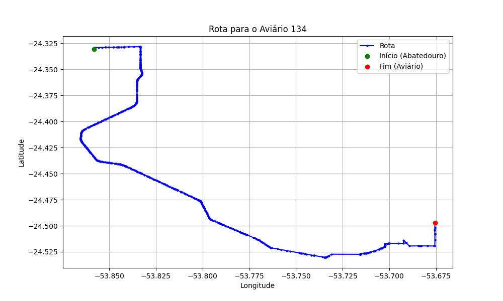

# Relatório de Rota - Aviário 134

## Informações Gerais
- **Produtor:** RODRIGO ZOTESSO
- **Latitude:** -24.496964
- **Longitude:** -53.676017

## Dados da Rota
- **Distância Real:** 42.88 km
- **Tempo Estimado (OSRM):** 55.5 minutos
- **Tempo Estimado (40 km/h):** 64.3 minutos

## Mapa da Rota

[Visualizar Mapa Interativo](mapa_interativo.html)

## Rota até o aviário
1. Saia da rua sem nome, siga por 10m.
2. Vire à direita na Avenida Ariosvaldo Bitencourt, siga por 200m.
3. Siga em frente na Avenida Ariosvaldo Bitencourt, siga por 2,6 km.
4. Vire em frente na Rodovia Alberto Dalcanale, siga por 27,1 km.
5. Vire à esquerda na rua sem nome, siga por 2,5 km.
6. New name em frente na rua sem nome, siga por 1,2 km.
7. Vire à direita na rua sem nome, siga por 4,5 km.
8. Vire à esquerda na rua sem nome, siga por 320m.
9. Vire acentuadamente à direita na rua sem nome, siga por 680m.
10. Vire à esquerda na rua sem nome, siga por 3,0 km.
11. New name em frente na rua sem nome, siga por 810m.
12. Você chegará ao aviário 134 à esquerda.
