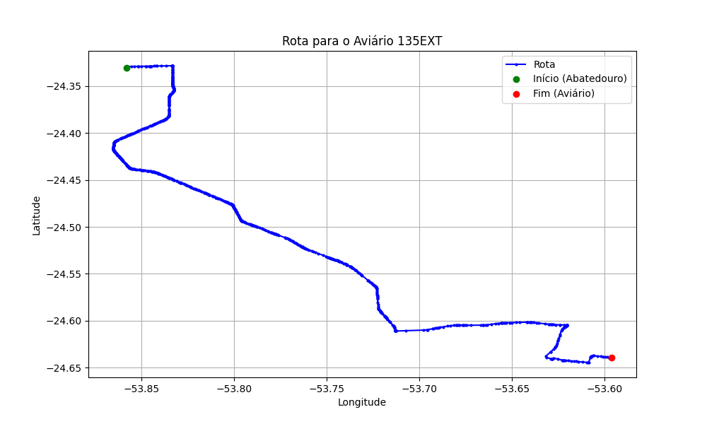

# Relatório de Rota - Aviário 135EXT

## Informações Gerais
- **Produtor:** PLUMA CRISTIANO PARIZZI4
- **Latitude:** -24.639528
- **Longitude:** -53.596494

## Dados da Rota
- **Distância Real:** 59.69 km
- **Tempo Estimado (OSRM):** 60.5 minutos
- **Tempo Estimado (40 km/h):** 89.5 minutos

## Mapa da Rota

[Visualizar Mapa Interativo](mapa_interativo.html)

## Rota até o aviário
1. Saia da rua sem nome, siga por 10m.
2. Vire à direita na Avenida Ariosvaldo Bitencourt, siga por 200m.
3. Siga em frente na Avenida Ariosvaldo Bitencourt, siga por 2,6 km.
4. Vire em frente na Rodovia Alberto Dalcanale, siga por 38,7 km.
5. Vire levemente à esquerda na rua sem nome, siga por 130m.
6. Vire à esquerda na rua sem nome, siga por 9,5 km.
7. Vire levemente à direita na rua sem nome, siga por 50m.
8. Vire em frente na Rodovia Deputado Moacir Micheletto, siga por 3,9 km.
9. Vire à esquerda na rua sem nome, siga por 160m.
10. Vire à esquerda na rua sem nome, siga por 490m.
11. Vire à direita na rua sem nome, siga por 2,0 km.
12. End of road à esquerda na rua sem nome, siga por 880m.
13. Vire à direita na rua sem nome, siga por 1,0 km.
14. Você chegará ao aviário 135EXT à direita.
