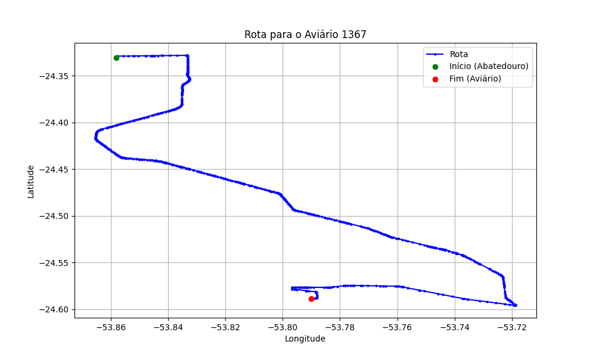

# Relatório de Rota - Aviário 1367

## Informações Gerais
- **Produtor:** GILMAR MALACARNE
- **Latitude:** -24.587461
- **Longitude:** -53.790283

## Dados da Rota
- **Distância Real:** 50.49 km
- **Tempo Estimado (OSRM):** 48.0 minutos
- **Tempo Estimado (40 km/h):** 75.7 minutos

## Mapa da Rota

[Visualizar Mapa Interativo](mapa_interativo.html)

## Rota até o aviário
1. Saia da rua sem nome, siga por 10m.
2. Vire à direita na Avenida Ariosvaldo Bitencourt, siga por 200m.
3. Siga em frente na Avenida Ariosvaldo Bitencourt, siga por 2,6 km.
4. Vire em frente na Rodovia Alberto Dalcanale, siga por 37,0 km.
5. Vire acentuadamente à direita na rua sem nome, siga por 8,6 km.
6. Vire à esquerda na Rua Conde Pacelli, siga por 250m.
7. End of road à esquerda na rua sem nome, siga por 570m.
8. New name em frente na rua sem nome, siga por 360m.
9. Vire à direita na rua sem nome, siga por 950m.
10. Você chegará ao aviário 1367 à direita.
