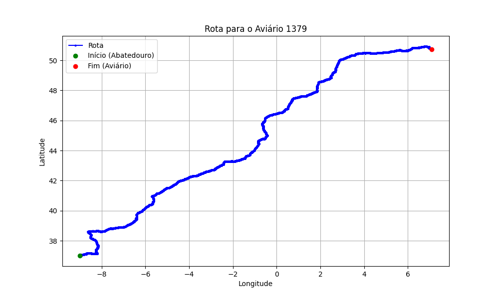

# Relatório de Rota - Aviário 1379

## Informações Gerais
- **Produtor:** FLAVIO CLAYTON SALVADOR
- **Latitude:** 50.721435
- **Longitude:** 7.087401

## Dados da Rota
- **Distância Real:** 2504.05 km
- **Tempo Estimado (OSRM):** 1598.3 minutos
- **Tempo Estimado (40 km/h):** 3756.1 minutos

## Mapa da Rota

[Visualizar Mapa Interativo](mapa_interativo.html)

## Rota até o aviário
1. Saia da rua sem nome, siga por 60m.
2. New name em frente na rua sem nome, siga por 5,8 km.
3. Roundabout em frente na rua sem nome, siga por 60m.
4. Exit roundabout em frente na rua sem nome, siga por 12,2 km.
5. Roundabout à direita na rua sem nome, siga por 40m.
6. Exit roundabout levemente à direita na rua sem nome, siga por 840m.
7. New name em frente na rua sem nome, siga por 1,8 km.
8. Roundabout em frente na rua sem nome, siga por 50m.
9. Exit roundabout à direita na rua sem nome, siga por 1,2 km.
10. Roundabout à direita na rua sem nome, siga por 60m.
11. Exit roundabout em frente na rua sem nome, siga por 40m.
12. New name em frente na N125, siga por 1,0 km.
13. Roundabout em frente na N125, siga por 30m.
14. Exit roundabout em frente na N125, siga por 1,5 km.
15. Roundabout levemente à direita na N125, siga por 60m.
16. Exit roundabout levemente à direita na N125, siga por 1,4 km.
17. Roundabout à direita na rua sem nome, siga por 50m.
18. Exit roundabout à direita na rua sem nome, siga por 2,5 km.
19. Roundabout levemente à direita na rua sem nome, siga por 50m.
20. Exit roundabout levemente à direita na rua sem nome, siga por 1,9 km.
21. Roundabout levemente à direita na rua sem nome, siga por 40m.
22. Exit roundabout à direita na rua sem nome, siga por 1,1 km.
23. Roundabout levemente à direita na rua sem nome, siga por 30m.
24. Exit roundabout à direita na rua sem nome, siga por 140m.
25. New name em frente na rua sem nome, siga por 280m.
26. New name em frente na rua sem nome, siga por 2,4 km.
27. Roundabout levemente à direita na rua sem nome, siga por 120m.
28. Exit roundabout à direita na rua sem nome, siga por 860m.
29. Roundabout levemente à direita na rua sem nome, siga por 170m.
30. Exit roundabout levemente à direita na rua sem nome, siga por 4,2 km.
31. Fork levemente à direita na rua sem nome, siga por 300m.
32. Siga em frente na Via do Infante, siga por 48,8 km.
33. Off ramp levemente à direita na rua sem nome, siga por 680m.
34. New name em frente na Autoestrada do Sul, siga por 4,7 km.
35. Siga em frente na Autoestrada do Sul, siga por 177,2 km.
36. Off ramp levemente à direita na rua sem nome, siga por 1,1 km.
37. Siga em frente na Autoestrada do Alentejo Central, siga por 135,5 km.
38. Fork levemente à direita na Autoestrada do Alentejo Central, siga por 50m.
39. Fork levemente à esquerda na Autoestrada do Alentejo Central, siga por 21,3 km.
40. New name em frente na Autovía del Suroeste, siga por 7,2 km.
41. Off ramp levemente à direita na rua sem nome, siga por 780m.
42. Fork levemente à esquerda na rua sem nome, siga por 530m.
43. Siga em frente na Carretera de Cáceres a Badajoz, siga por 240m.
44. Roundabout em frente na Carretera de Cáceres a Badajoz, siga por 30m.
45. Exit roundabout levemente à direita na Carretera de Cáceres a Badajoz, siga por 1,0 km.
46. Roundabout levemente à direita na Carretera de Cáceres a Badajoz, siga por 80m.
47. Exit roundabout em frente na Carretera de Cáceres a Badajoz, siga por 860m.
48. Roundabout à direita na Carretera de Cáceres a Badajoz, siga por 40m.
49. Exit roundabout em frente na Carretera de Cáceres a Badajoz, siga por 16,0 km.
50. Siga em frente na Carretera de Cáceres a Badajoz, siga por 14,2 km.
51. Fork levemente à esquerda na rua sem nome, siga por 510m.
52. Siga em frente na Carretera de Cáceres a Badajoz, siga por 640m.
53. New name em frente na Avenida de Badajoz, siga por 280m.
54. New name em frente na Carretera de Cáceres a Badajoz, siga por 45,6 km.
55. Off ramp levemente à direita na rua sem nome, siga por 670m.
56. Siga em frente na Autovía Ruta de la Plata, siga por 205,9 km.
57. Roundabout à direita na Autovía de Castilla, siga por 110m.
58. Exit roundabout em frente na Autovía de Castilla, siga por 330m.
59. Siga em frente na Autovía de Castilla, siga por 4,1 km.
60. Fork levemente à esquerda na Autovía de Castilla, siga por 86,5 km.
61. Siga em frente na Autovía del Noroeste, siga por 1,5 km.
62. Fork levemente à direita na Autovía de Castilla, siga por 64,1 km.
63. Fork levemente à esquerda na Autovía de Castilla, siga por 74,8 km.
64. Fork levemente à esquerda na Autovía de Castilla, siga por 6,6 km.
65. Siga em frente na Circunvalación de Burgos, siga por 4,3 km.
66. Siga em frente na Autovía del Norte, siga por 7,2 km.
67. New name em frente na Autopista del Norte, siga por 83,0 km.
68. Siga em frente na rua sem nome, siga por 14,3 km.
69. Fork levemente à esquerda na rua sem nome, siga por 9,0 km.
70. Off ramp levemente à direita na rua sem nome, siga por 260m.
71. Fork levemente à esquerda na rua sem nome, siga por 260m.
72. Fork levemente à direita na rua sem nome, siga por 430m.
73. Fork levemente à esquerda na rua sem nome, siga por 260m.
74. Siga em frente na rua sem nome, siga por 900m.
75. Off ramp levemente à direita na rua sem nome, siga por 450m.
76. New name em frente na rua sem nome, siga por 280m.
77. New name em frente na rua sem nome, siga por 460m.
78. Fork levemente à direita na rua sem nome, siga por 1,2 km.
79. Fork levemente à esquerda na rua sem nome, siga por 380m.
80. Siga em frente na rua sem nome, siga por 43,2 km.
81. Fork levemente à esquerda na Iparraldeko autobidea, siga por 960m.
82. Siga em frente na Kantauriko autobidea, siga por 49,5 km.
83. New name em frente na Bizkaiko Golkoko Autobidea, siga por 140m.
84. New name em frente na Urumea Zubia, siga por 1,0 km.
85. New name em frente na AP-1 / AP-8, siga por 2,2 km.
86. New name em frente na Aginaztegi tunela, siga por 520m.
87. New name em frente na Bizkaiko Golkoko Autobidea, siga por 2,8 km.
88. New name em frente na AP-1 / AP-8, siga por 1,8 km.
89. New name em frente na Bizkaiko Golkoko Autobidea, siga por 3,4 km.
90. Fork levemente à esquerda na Bizkaiko Golkoko Autobidea, siga por 230m.
91. New name em frente na AP-1 / AP-8, siga por 7,4 km.
92. New name em frente na Zubi Nazioartekoa, siga por 110m.
93. New name em frente na Autoroute de la Côte Basque, siga por 31,4 km.
94. New name em frente na Autoroute des Landes, siga por 173,9 km.
95. Fork levemente à direita na rua sem nome, siga por 730m.
96. Siga em frente na Rocade Extérieure, siga por 18,8 km.
97. Fork levemente à esquerda na rua sem nome, siga por 1,0 km.
98. Siga em frente na L'Aquitaine, siga por 322,2 km.
99. Fork levemente à esquerda na L'Aquitaine, siga por 229,8 km.
100. Fork levemente à direita na L'Aquitaine, siga por 3,7 km.
101. Fork levemente à direita na rua sem nome, siga por 2,5 km.
102. Off ramp levemente à direita na rua sem nome, siga por 840m.
103. Siga em frente na rua sem nome, siga por 1,0 km.
104. Fork levemente à esquerda na rua sem nome, siga por 1,7 km.
105. New name em frente na rua sem nome, siga por 11,8 km.
106. Siga em frente na Autoroute de l’Est, siga por 2,1 km.
107. Fork levemente à direita na rua sem nome, siga por 8,3 km.
108. Siga em frente na rua sem nome, siga por 690m.
109. Fork levemente à esquerda na rua sem nome, siga por 8,9 km.
110. Fork levemente à esquerda na rua sem nome, siga por 1,6 km.
111. Off ramp levemente à esquerda na rua sem nome, siga por 710m.
112. Siga em frente na Autoroute du Nord, siga por 121,3 km.
113. Fork levemente à direita na rua sem nome, siga por 77,1 km.
114. New name em frente na rua sem nome, siga por 36,9 km.
115. Fork levemente à direita na Autoroute de Wallonie, siga por 3,1 km.
116. Fork levemente à esquerda na rua sem nome, siga por 40m.
117. Siga em frente na Autoroute de Wallonie, siga por 650m.
118. Fork levemente à direita na rua sem nome, siga por 50m.
119. Siga em frente na Autoroute de Wallonie, siga por 99,0 km.
120. Fork levemente à direita na rua sem nome, siga por 39,3 km.
121. New name em frente na König Baudouin Autobahn - Autoroute Roi Baudouin, siga por 11,5 km.
122. New name em frente na rua sem nome, siga por 10,4 km.
123. Off ramp levemente à direita na rua sem nome, siga por 320m.
124. Fork levemente à esquerda na rua sem nome, siga por 720m.
125. Siga em frente na rua sem nome, siga por 61,0 km.
126. Off ramp levemente à direita na rua sem nome, siga por 180m.
127. Fork levemente à direita na rua sem nome, siga por 670m.
128. Siga em frente na rua sem nome, siga por 17,5 km.
129. Off ramp levemente à direita na rua sem nome, siga por 960m.
130. Siga em frente na rua sem nome, siga por 1,4 km.
131. Off ramp levemente à direita na rua sem nome, siga por 350m.
132. New name à direita na Hermann-Wandersleb-Ring, siga por 260m.
133. Vire à esquerda na Frongasse, siga por 290m.
134. Vire à esquerda na Magdalenenstraße, siga por 240m.
135. New name em frente na Sebastianstraße, siga por 850m.
136. Vire à direita na Rudolf-Stöcker-Weg, siga por 110m.
137. Vire à esquerda na rua sem nome, siga por 30m.
138. Vire à esquerda na rua sem nome, siga por 30m.
139. Você chegará ao aviário 1379 à esquerda.
