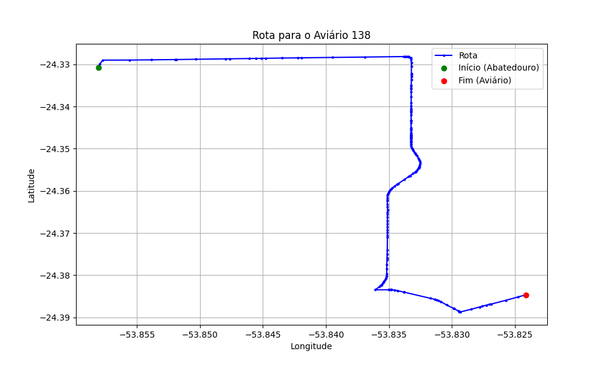

# Relatório de Rota - Aviário 138

## Informações Gerais
- **Produtor:** MARTIM ROGERIO REINKE
- **Latitude:** -24.385194
- **Longitude:** -53.823611

## Dados da Rota
- **Distância Real:** 10.51 km
- **Tempo Estimado (OSRM):** 13.2 minutos
- **Tempo Estimado (40 km/h):** 15.8 minutos

## Mapa da Rota

[Visualizar Mapa Interativo](mapa_interativo.html)

## Rota até o aviário
1. Saia da rua sem nome, siga por 10m.
2. Vire à direita na Avenida Ariosvaldo Bitencourt, siga por 200m.
3. Siga em frente na Avenida Ariosvaldo Bitencourt, siga por 2,6 km.
4. Vire em frente na Rodovia Alberto Dalcanale, siga por 6,0 km.
5. Vire à esquerda na rua sem nome, siga por 950m.
6. Siga em frente na rua sem nome, siga por 700m.
7. Você chegará ao aviário 138 à direita.
