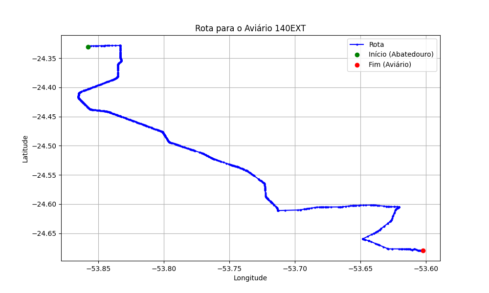

# Relatório de Rota - Aviário 140EXT

## Informações Gerais
- **Produtor:** PLUMA VIVIANE MARIA VALTRICH1
- **Latitude:** -24.679333
- **Longitude:** -53.60225

## Dados da Rota
- **Distância Real:** 63.75 km
- **Tempo Estimado (OSRM):** 62.8 minutos
- **Tempo Estimado (40 km/h):** 95.6 minutos

## Mapa da Rota

[Visualizar Mapa Interativo](mapa_interativo.html)

## Rota até o aviário
1. Saia da rua sem nome, siga por 10m.
2. Vire à direita na Avenida Ariosvaldo Bitencourt, siga por 200m.
3. Siga em frente na Avenida Ariosvaldo Bitencourt, siga por 2,6 km.
4. Vire em frente na Rodovia Alberto Dalcanale, siga por 38,7 km.
5. Vire levemente à esquerda na rua sem nome, siga por 130m.
6. Vire à esquerda na rua sem nome, siga por 9,5 km.
7. Vire levemente à direita na rua sem nome, siga por 50m.
8. Vire em frente na Rodovia Deputado Moacir Micheletto, siga por 6,8 km.
9. Vire à esquerda na Estrada para Ouro Preto, siga por 4,4 km.
10. Vire à direita na rua sem nome, siga por 250m.
11. Vire à esquerda na rua sem nome, siga por 270m.
12. New name levemente à direita na rua sem nome, siga por 410m.
13. Vire à esquerda na rua sem nome, siga por 360m.
14. Você chegará ao aviário 140EXT à direita.
