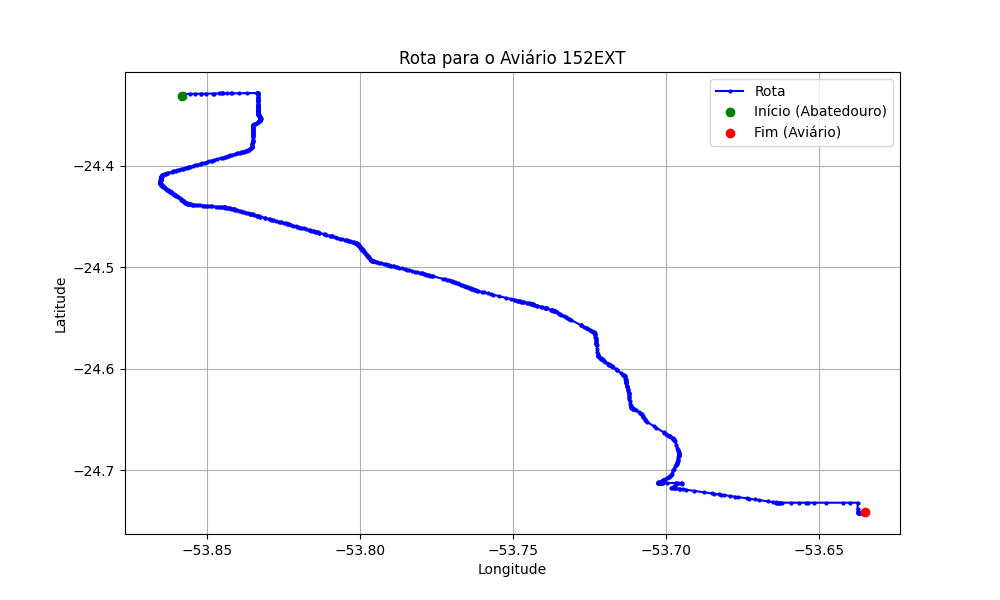

# Relatório de Rota - Aviário 152EXT

## Informações Gerais
- **Produtor:** PLUMA GENUIR ANTONIO NODARI2
- **Latitude:** -24.740776
- **Longitude:** -53.635337

## Dados da Rota
- **Distância Real:** 62.61 km
- **Tempo Estimado (OSRM):** 59.4 minutos
- **Tempo Estimado (40 km/h):** 93.9 minutos

## Mapa da Rota

[Visualizar Mapa Interativo](mapa_interativo.html)

## Rota até o aviário
1. Saia da rua sem nome, siga por 10m.
2. Vire à direita na Avenida Ariosvaldo Bitencourt, siga por 200m.
3. Siga em frente na Avenida Ariosvaldo Bitencourt, siga por 2,6 km.
4. Vire em frente na Rodovia Alberto Dalcanale, siga por 50,5 km.
5. Vire à esquerda na rua sem nome, siga por 70m.
6. Vire levemente à esquerda na rua sem nome, siga por 760m.
7. Vire acentuadamente à direita na rua sem nome, siga por 610m.
8. Vire à esquerda na Estrada para São Luiz do Oeste, siga por 6,5 km.
9. Vire à direita na rua sem nome, siga por 1,2 km.
10. Vire à esquerda na rua sem nome, siga por 150m.
11. Você chegará ao aviário 152EXT à esquerda.
