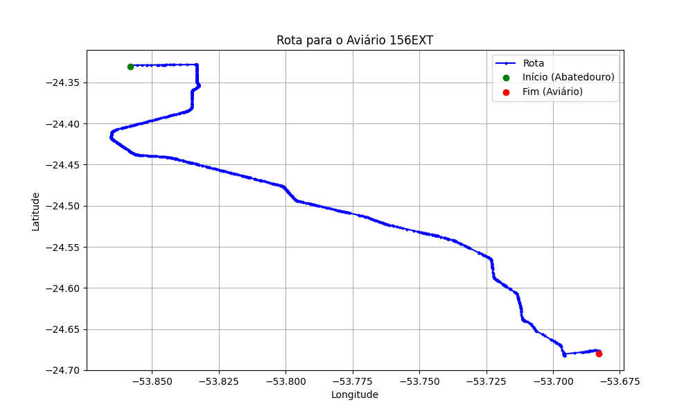

# Relatório de Rota - Aviário 156EXT

## Informações Gerais
- **Produtor:** PLUMA HIGINO BATISTA MINUSSI1
- **Latitude:** -24.680115
- **Longitude:** -53.683951

## Dados da Rota
- **Distância Real:** 51.96 km
- **Tempo Estimado (OSRM):** 49.6 minutos
- **Tempo Estimado (40 km/h):** 77.9 minutos

## Mapa da Rota

[Visualizar Mapa Interativo](mapa_interativo.html)

## Rota até o aviário
1. Saia da rua sem nome, siga por 10m.
2. Vire à direita na Avenida Ariosvaldo Bitencourt, siga por 200m.
3. Siga em frente na Avenida Ariosvaldo Bitencourt, siga por 2,6 km.
4. Vire em frente na Rodovia Alberto Dalcanale, siga por 47,0 km.
5. Vire acentuadamente à direita na rua sem nome, siga por 1,7 km.
6. End of road à direita na rua sem nome, siga por 440m.
7. Você chegará ao aviário 156EXT à direita.
