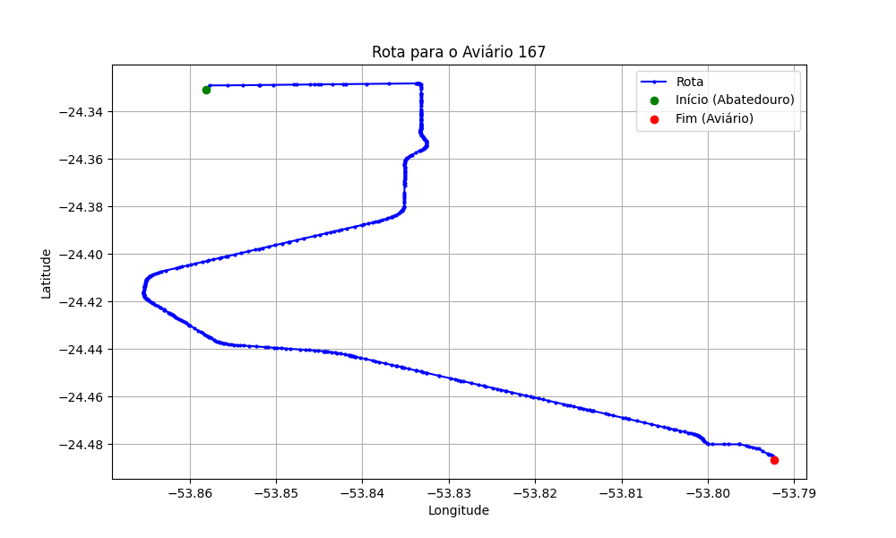

# Relatório de Rota - Aviário 167

## Informações Gerais
- **Produtor:** SEDIANE FATIMA GASPARETTO
- **Latitude:** -24.486633
- **Longitude:** -53.792675

## Dados da Rota
- **Distância Real:** 25.10 km
- **Tempo Estimado (OSRM):** 25.8 minutos
- **Tempo Estimado (40 km/h):** 37.7 minutos

## Mapa da Rota

[Visualizar Mapa Interativo](mapa_interativo.html)

## Rota até o aviário
1. Saia da rua sem nome, siga por 10m.
2. Vire à direita na Avenida Ariosvaldo Bitencourt, siga por 200m.
3. Siga em frente na Avenida Ariosvaldo Bitencourt, siga por 2,6 km.
4. Vire em frente na Rodovia Alberto Dalcanale, siga por 21,0 km.
5. Vire à esquerda na rua sem nome, siga por 250m.
6. New name em frente na Rua Corbélia, siga por 430m.
7. New name levemente à direita na rua sem nome, siga por 570m.
8. Você chegará ao aviário 167 à direita.
