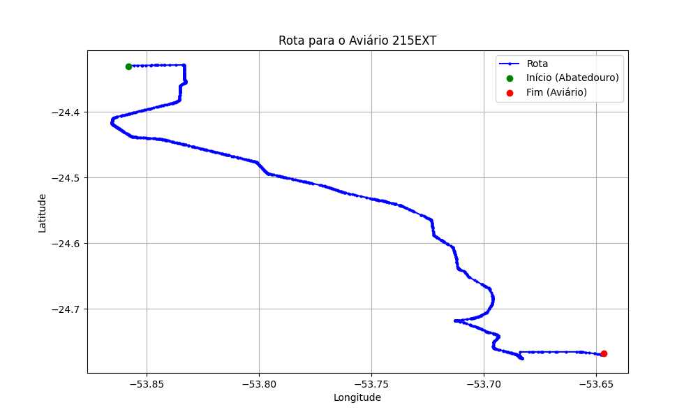

# Relatório de Rota - Aviário 215EXT

## Informações Gerais
- **Produtor:** PLUMA PEDRO EBERT2
- **Latitude:** -24.767139
- **Longitude:** -53.645722

## Dados da Rota
- **Distância Real:** 67.34 km
- **Tempo Estimado (OSRM):** 63.6 minutos
- **Tempo Estimado (40 km/h):** 101.0 minutos

## Mapa da Rota

[Visualizar Mapa Interativo](mapa_interativo.html)

## Rota até o aviário
1. Saia da rua sem nome, siga por 10m.
2. Vire à direita na Avenida Ariosvaldo Bitencourt, siga por 200m.
3. Siga em frente na Avenida Ariosvaldo Bitencourt, siga por 2,6 km.
4. Vire em frente na Rodovia Alberto Dalcanale, siga por 51,7 km.
5. Siga em frente na rua sem nome, siga por 230m.
6. Siga em frente na Rodovia Perimetral Norte, siga por 90m.
7. New name em frente na Rodovia José Neves Formighieri, siga por 7,2 km.
8. Off ramp levemente à esquerda na rua sem nome, siga por 170m.
9. Vire à esquerda na rua sem nome, siga por 310m.
10. Siga em frente na Rodovia José Neves Formighieri, siga por 40m.
11. Vire à direita na rua sem nome, siga por 780m.
12. End of road à direita na Estrada para Bom Princípio, siga por 3,8 km.
13. Vire à esquerda na rua sem nome, siga por 210m.
14. Você chegará ao aviário 215EXT.
