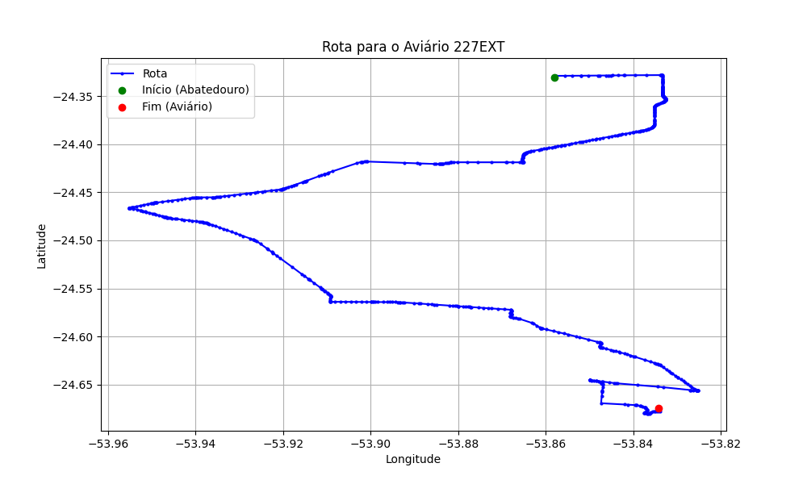

# Relatório de Rota - Aviário 227EXT

## Informações Gerais
- **Produtor:** PLUMA SERGIO TARCISIO LUNKES1
- **Latitude:** -24.674278
- **Longitude:** -53.833667

## Dados da Rota
- **Distância Real:** 61.24 km
- **Tempo Estimado (OSRM):** 68.7 minutos
- **Tempo Estimado (40 km/h):** 91.9 minutos

## Mapa da Rota

[Visualizar Mapa Interativo](mapa_interativo.html)

## Rota até o aviário
1. Saia da rua sem nome, siga por 10m.
2. Vire à direita na Avenida Ariosvaldo Bitencourt, siga por 200m.
3. Siga em frente na Avenida Ariosvaldo Bitencourt, siga por 2,6 km.
4. Vire em frente na Rodovia Alberto Dalcanale, siga por 11,1 km.
5. Siga em frente na rua sem nome, siga por 60m.
6. Vire levemente à direita na rua sem nome, siga por 2,0 km.
7. Vire em frente na rua sem nome, siga por 1,8 km.
8. Vire em frente na rua sem nome, siga por 8,0 km.
9. Vire à esquerda na rua sem nome, siga por 20m.
10. Vire à direita na Avenida Horizontina, siga por 1,2 km.
11. New name em frente na Rodovia Prefeito Daniel Wutzke, siga por 10,9 km.
12. Vire à esquerda na Avenida Marechal Castelo Branco, siga por 3,3 km.
13. Vire levemente à direita na Estrada do Distrito São Miguel, siga por 1,0 km.
14. Siga em frente na Estrada do Distrito São Miguel, siga por 5,5 km.
15. New name em frente na Rua Trës de Outubro, siga por 410m.
16. New name em frente na Estrada do Distrito São Miguel, siga por 4,7 km.
17. Siga em frente na rua sem nome, siga por 200m.
18. Siga em frente na Rodovia Doutor Ernesto Dall´ Óglio, siga por 2,4 km.
19. Off ramp levemente à esquerda na rua sem nome, siga por 450m.
20. Siga em frente na Rodovia Doutor Ernesto Dall´ Óglio, siga por 90m.
21. Off ramp levemente à direita na rua sem nome, siga por 40m.
22. Vire à direita na rua sem nome, siga por 2,5 km.
23. Vire à esquerda na rua sem nome, siga por 2,0 km.
24. Vire acentuadamente à esquerda na rua sem nome, siga por 450m.
25. Vire à esquerda na rua sem nome, siga por 330m.
26. Você chegará ao aviário 227EXT à direita.
