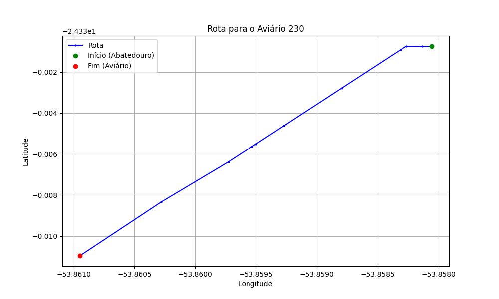

# Relatório de Rota - Aviário 230

## Informações Gerais
- **Produtor:** NELSON BENETTI
- **Latitude:** -24.339917
- **Longitude:** -53.865889

## Dados da Rota
- **Distância Real:** 1.19 km
- **Tempo Estimado (OSRM):** 1.9 minutos
- **Tempo Estimado (40 km/h):** 1.8 minutos

## Mapa da Rota

[Visualizar Mapa Interativo](mapa_interativo.html)

## Rota até o aviário
1. Saia da rua sem nome, siga por 10m.
2. Vire à esquerda na Avenida Ariosvaldo Bitencourt, siga por 1,2 km.
3. Você chegará ao aviário 230.
