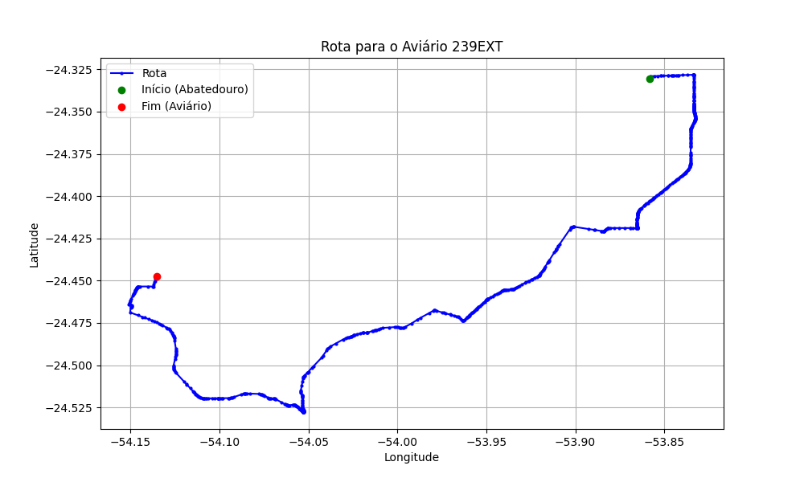

# Relatório de Rota - Aviário 239EXT

## Informações Gerais
- **Produtor:** PLUMA ALINE FRANCIELE ZART2
- **Latitude:** -24.446889
- **Longitude:** -54.136306

## Dados da Rota
- **Distância Real:** 57.61 km
- **Tempo Estimado (OSRM):** 61.6 minutos
- **Tempo Estimado (40 km/h):** 86.4 minutos

## Mapa da Rota

[Visualizar Mapa Interativo](mapa_interativo.html)

## Rota até o aviário
1. Saia da rua sem nome, siga por 10m.
2. Vire à direita na Avenida Ariosvaldo Bitencourt, siga por 200m.
3. Siga em frente na Avenida Ariosvaldo Bitencourt, siga por 2,6 km.
4. Vire em frente na Rodovia Alberto Dalcanale, siga por 11,1 km.
5. Siga em frente na rua sem nome, siga por 60m.
6. Vire levemente à direita na rua sem nome, siga por 2,0 km.
7. Vire em frente na rua sem nome, siga por 1,8 km.
8. Vire em frente na rua sem nome, siga por 10,9 km.
9. Vire em frente na rua sem nome, siga por 11,5 km.
10. Roundabout à direita na rua sem nome, siga por 10m.
11. Exit roundabout levemente à direita na rua sem nome, siga por 300m.
12. Siga em frente na rua sem nome, siga por 13,6 km.
13. Vire à direita na rua sem nome, siga por 520m.
14. Vire à esquerda na rua sem nome, siga por 160m.
15. Vire à direita na rua sem nome, siga por 1,3 km.
16. End of road à direita na rua sem nome, siga por 850m.
17. Vire à esquerda na rua sem nome, siga por 690m.
18. Você chegará ao aviário 239EXT à esquerda.
