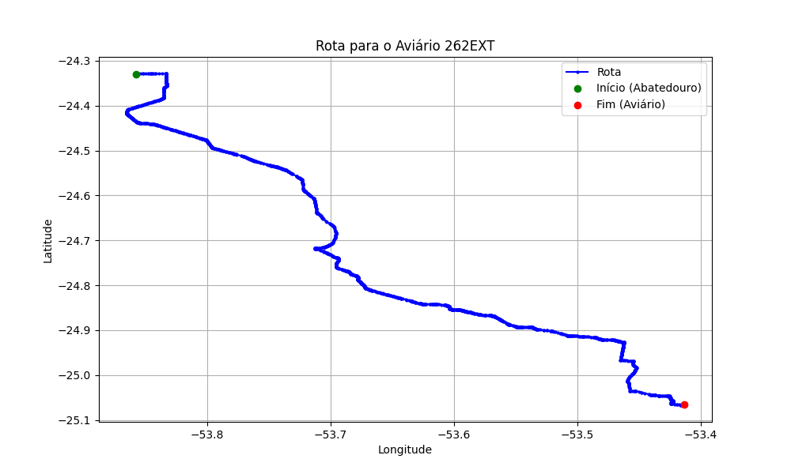

# Relatório de Rota - Aviário 262EXT

## Informações Gerais
- **Produtor:** PLUMA VALMOR ANTONIO BEBBER2
- **Latitude:** -25.067694
- **Longitude:** -53.412694

## Dados da Rota
- **Distância Real:** 112.94 km
- **Tempo Estimado (OSRM):** 105.2 minutos
- **Tempo Estimado (40 km/h):** 169.4 minutos

## Mapa da Rota

[Visualizar Mapa Interativo](mapa_interativo.html)

## Rota até o aviário
1. Saia da rua sem nome, siga por 10m.
2. Vire à direita na Avenida Ariosvaldo Bitencourt, siga por 200m.
3. Siga em frente na Avenida Ariosvaldo Bitencourt, siga por 2,6 km.
4. Vire em frente na Rodovia Alberto Dalcanale, siga por 51,7 km.
5. Siga em frente na rua sem nome, siga por 230m.
6. Siga em frente na Rodovia Perimetral Norte, siga por 90m.
7. New name em frente na Rodovia José Neves Formighieri, siga por 37,0 km.
8. Off ramp levemente à direita na rua sem nome, siga por 620m.
9. Vire à direita na Rua Marechal Cândido Rondon, siga por 4,6 km.
10. Vire à esquerda na Rua Sérgio Djalma de Holanda, siga por 1,1 km.
11. Vire à direita na Rua Carlos Gomes, siga por 1,8 km.
12. Vire levemente à direita na Rua Rio da Paz, siga por 2,2 km.
13. New name em frente na Estrada Rio da Paz, siga por 3,8 km.
14. Vire à esquerda na rua sem nome, siga por 450m.
15. New name em frente na Estrada Alto Bom Retiro, siga por 3,3 km.
16. Vire à direita na rua sem nome, siga por 2,2 km.
17. End of road à esquerda na Estrada Scanagatta, siga por 970m.
18. Vire à esquerda na Linha Castanha, siga por 260m.
19. Você chegará ao aviário 262EXT à direita.
