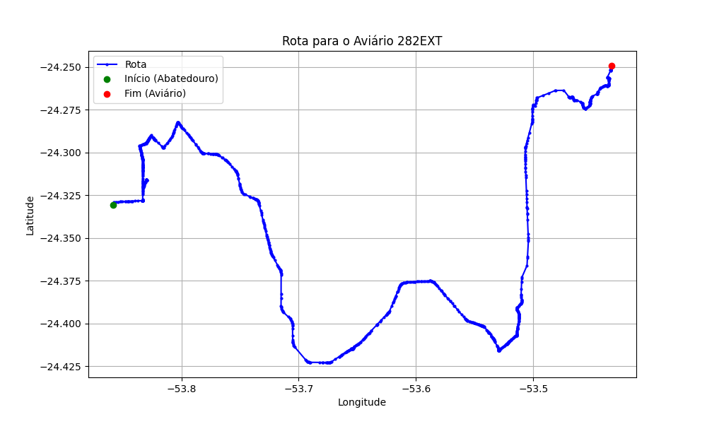

# Relatório de Rota - Aviário 282EXT

## Informações Gerais
- **Produtor:** PLUMA MOACIR GAMBINI1
- **Latitude:** -24.249444
- **Longitude:** -53.433889

## Dados da Rota
- **Distância Real:** 80.94 km
- **Tempo Estimado (OSRM):** 104.2 minutos
- **Tempo Estimado (40 km/h):** 121.4 minutos

## Mapa da Rota

[Visualizar Mapa Interativo](mapa_interativo.html)

## Rota até o aviário
1. Saia da rua sem nome, siga por 10m.
2. Vire à direita na Avenida Ariosvaldo Bitencourt, siga por 200m.
3. Siga em frente na Avenida Ariosvaldo Bitencourt, siga por 2,5 km.
4. Vire à esquerda na rua sem nome, siga por 1,5 km.
5. Vire levemente à esquerda na rua sem nome, siga por 660m.
6. Vire em frente na Rodovia Alberto Dalcanale, siga por 1,7 km.
7. New name em frente na Avenida Presidente Kennedy, siga por 960m.
8. Vire à direita na Rua Juscelino Kubitscheck, siga por 1,3 km.
9. Vire à direita na Rua Madre Teresa de Calcutá, siga por 440m.
10. New name em frente na rua sem nome, siga por 880m.
11. Vire à esquerda na rua sem nome, siga por 2,1 km.
12. Vire levemente à direita na Rodovia Deputado Edilson Alencar, siga por 24,6 km.
13. New name em frente na Avenida Sudoeste, siga por 490m.
14. End of road à direita na Avenida Praça São Roque, siga por 210m.
15. Vire à direita na Avenida Nordeste, siga por 540m.
16. New name em frente na Rodovia Deputado Edilson Alencar, siga por 14,7 km.
17. Vire à direita na rua sem nome, siga por 190m.
18. Vire em frente na Avenida Londrina, siga por 710m.
19. Vire à esquerda na rua sem nome, siga por 60m.
20. New name levemente à esquerda na rua sem nome, siga por 1,8 km.
21. Fork levemente à esquerda na rua sem nome, siga por 50m.
22. Vire levemente à esquerda na rua sem nome, siga por 50m.
23. Vire em frente na Avenida Tupassi, siga por 360m.
24. Roundabout à direita na Avenida Tupassi, siga por 20m.
25. Exit roundabout levemente à direita na Avenida Tupassi, siga por 1,4 km.
26. Fork levemente à direita na Avenida México, siga por 480m.
27. New name em frente na Rodovia Municipal para Terra Nova, siga por 13,1 km.
28. Vire à direita na Rua Apucarana, siga por 710m.
29. Vire à direita na rua sem nome, siga por 2,4 km.
30. Vire à direita na rua sem nome, siga por 1,9 km.
31. Vire à direita na rua sem nome, siga por 540m.
32. Vire à esquerda na rua sem nome, siga por 3,1 km.
33. New name em frente na rua sem nome, siga por 180m.
34. Vire à esquerda na Estrada Itacolomi, siga por 220m.
35. Vire à direita na rua sem nome, siga por 870m.
36. Você chegará ao aviário 282EXT à esquerda.
