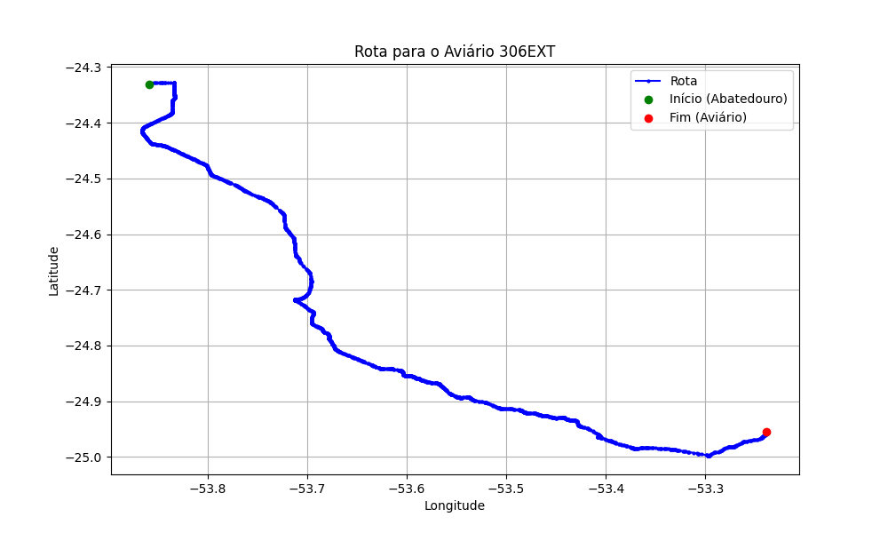

# Relatório de Rota - Aviário 306EXT

## Informações Gerais
- **Produtor:** PLUMA ROGELIO KARVATI1
- **Latitude:** -24.955388
- **Longitude:** -53.238361

## Dados da Rota
- **Distância Real:** 120.71 km
- **Tempo Estimado (OSRM):** 105.3 minutos
- **Tempo Estimado (40 km/h):** 181.1 minutos

## Mapa da Rota

[Visualizar Mapa Interativo](mapa_interativo.html)

## Rota até o aviário
1. Saia da rua sem nome, siga por 10m.
2. Vire à direita na Avenida Ariosvaldo Bitencourt, siga por 200m.
3. Siga em frente na Avenida Ariosvaldo Bitencourt, siga por 2,6 km.
4. Vire em frente na Rodovia Alberto Dalcanale, siga por 51,7 km.
5. Siga em frente na rua sem nome, siga por 230m.
6. Siga em frente na Rodovia Perimetral Norte, siga por 90m.
7. New name em frente na Rodovia José Neves Formighieri, siga por 45,5 km.
8. Siga em frente na rua sem nome, siga por 140m.
9. Off ramp levemente à esquerda na rua sem nome, siga por 310m.
10. Fork levemente à direita na rua sem nome, siga por 210m.
11. New name em frente na rua sem nome, siga por 11,5 km.
12. Vire à direita na rua sem nome, siga por 130m.
13. Vire levemente à esquerda na rua sem nome, siga por 20m.
14. Vire à direita na rua sem nome, siga por 60m.
15. New name em frente na Estrada Jacob Munhak, siga por 6,3 km.
16. New name em frente na Avenida São Jorge, siga por 1,6 km.
17. Vire à esquerda na rua sem nome, siga por 170m.
18. Você chegará ao aviário 306EXT à direita.
