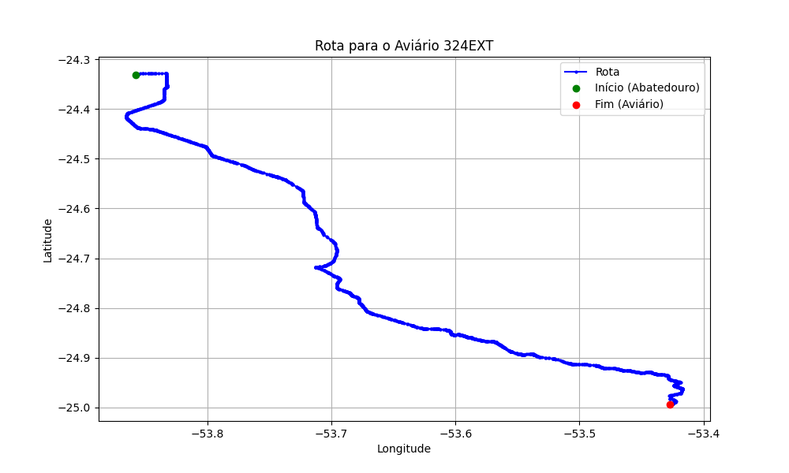

# Relatório de Rota - Aviário 324EXT

## Informações Gerais
- **Produtor:** PLUMA PRIMO FONTANELA 1
- **Latitude:** -24.99375
- **Longitude:** -53.427194

## Dados da Rota
- **Distância Real:** 104.63 km
- **Tempo Estimado (OSRM):** 92.7 minutos
- **Tempo Estimado (40 km/h):** 156.9 minutos

## Mapa da Rota

[Visualizar Mapa Interativo](mapa_interativo.html)

## Rota até o aviário
1. Saia da rua sem nome, siga por 10m.
2. Vire à direita na Avenida Ariosvaldo Bitencourt, siga por 200m.
3. Siga em frente na Avenida Ariosvaldo Bitencourt, siga por 2,6 km.
4. Vire em frente na Rodovia Alberto Dalcanale, siga por 51,7 km.
5. Siga em frente na rua sem nome, siga por 230m.
6. Siga em frente na Rodovia Perimetral Norte, siga por 90m.
7. New name em frente na Rodovia José Neves Formighieri, siga por 42,6 km.
8. Off ramp levemente à direita na rua sem nome, siga por 160m.
9. Vire em frente na Marginal BR-467, siga por 520m.
10. Vire à direita na Avenida Rocha Pombo, siga por 930m.
11. End of road em frente na rua sem nome, siga por 20m.
12. End of road à esquerda na rua sem nome, siga por 20m.
13. End of road em frente na Rua Olindo Periollo, siga por 1,0 km.
14. Roundabout em frente na Rua Áustria, siga por 30m.
15. Exit roundabout levemente à direita na Rua Áustria, siga por 160m.
16. Roundabout à direita na Rua Áustria, siga por 40m.
17. Exit roundabout à direita na Rua Áustria, siga por 760m.
18. Vire à direita na Rua Itália, siga por 1,1 km.
19. Vire à esquerda na Rua Estocolmo, siga por 280m.
20. End of road à esquerda na Rua Grécia, siga por 50m.
21. Vire à direita na Estrada Alto São Salvador, siga por 510m.
22. Siga em frente na Estrada Alto São Salvador, siga por 800m.
23. Vire levemente à direita na rua sem nome, siga por 860m.
24. Você chegará ao aviário 324EXT à direita.
