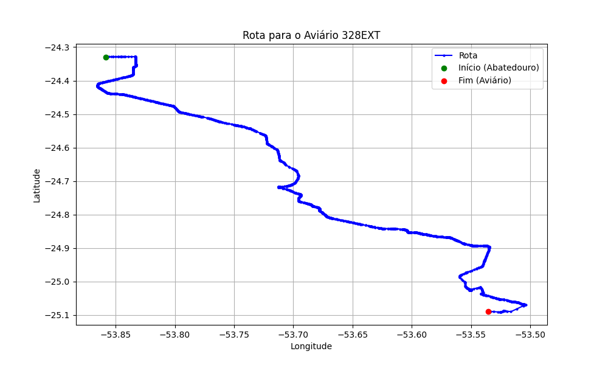

# Relatório de Rota - Aviário 328EXT

## Informações Gerais
- **Produtor:** PLUMA DIOGENES RAISEL DA CRUZ2
- **Latitude:** -25.089306
- **Longitude:** -53.535694

## Dados da Rota
- **Distância Real:** 113.48 km
- **Tempo Estimado (OSRM):** 111.4 minutos
- **Tempo Estimado (40 km/h):** 170.2 minutos

## Mapa da Rota

[Visualizar Mapa Interativo](mapa_interativo.html)

## Rota até o aviário
1. Saia da rua sem nome, siga por 10m.
2. Vire à direita na Avenida Ariosvaldo Bitencourt, siga por 200m.
3. Siga em frente na Avenida Ariosvaldo Bitencourt, siga por 2,6 km.
4. Vire em frente na Rodovia Alberto Dalcanale, siga por 51,7 km.
5. Siga em frente na rua sem nome, siga por 230m.
6. Siga em frente na Rodovia Perimetral Norte, siga por 90m.
7. New name em frente na Rodovia José Neves Formighieri, siga por 29,3 km.
8. Off ramp levemente à direita na rua sem nome, siga por 15,0 km.
9. Off ramp levemente à direita na rua sem nome, siga por 400m.
10. Siga em frente na rua sem nome, siga por 1,2 km.
11. Vire à direita na Estrada Rio Saltinho, siga por 4,7 km.
12. Vire à esquerda na rua sem nome, siga por 3,0 km.
13. Vire acentuadamente à direita na rua sem nome, siga por 2,6 km.
14. Vire à direita na rua sem nome, siga por 2,0 km.
15. Vire à esquerda na rua sem nome, siga por 150m.
16. Vire à direita na rua sem nome, siga por 230m.
17. Você chegará ao aviário 328EXT à direita.
