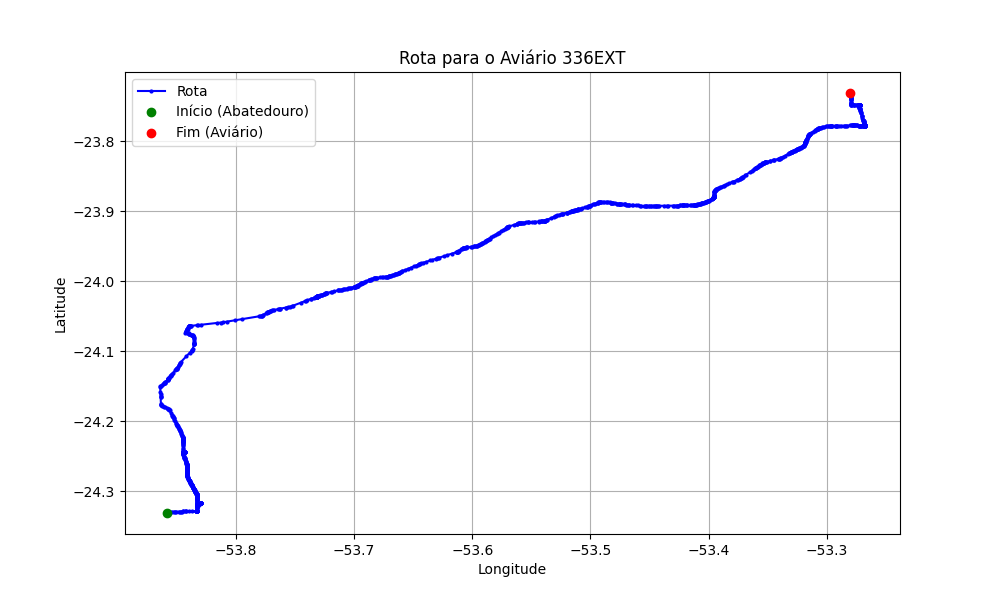

# Relatório de Rota - Aviário 336EXT

## Informações Gerais
- **Produtor:** PLUMA CARLOS CALIXTO 1
- **Latitude:** -23.731083
- **Longitude:** -53.281444

## Dados da Rota
- **Distância Real:** 111.75 km
- **Tempo Estimado (OSRM):** 99.6 minutos
- **Tempo Estimado (40 km/h):** 167.6 minutos

## Mapa da Rota

[Visualizar Mapa Interativo](mapa_interativo.html)

## Rota até o aviário
1. Saia da rua sem nome, siga por 10m.
2. Vire à direita na Avenida Ariosvaldo Bitencourt, siga por 200m.
3. Siga em frente na Avenida Ariosvaldo Bitencourt, siga por 2,5 km.
4. Vire à esquerda na rua sem nome, siga por 1,5 km.
5. Vire levemente à esquerda na rua sem nome, siga por 660m.
6. Vire em frente na Rodovia Alberto Dalcanale, siga por 1,7 km.
7. New name em frente na Avenida Presidente Kennedy, siga por 7,2 km.
8. Fork levemente à direita na rua sem nome, siga por 20,3 km.
9. Vire à direita na Avenida Brigadeiro Pamplona Pinto, siga por 1,1 km.
10. Siga em frente na rua sem nome, siga por 130m.
11. Siga em frente na rua sem nome, siga por 12,0 km.
12. Vire levemente à direita na rua sem nome, siga por 140m.
13. Siga em frente na rua sem nome, siga por 60m.
14. Siga em frente na rua sem nome, siga por 23,7 km.
15. Vire em frente na rua sem nome, siga por 34,5 km.
16. Vire à esquerda na rua sem nome, siga por 3,4 km.
17. Roundabout em frente na Avenida Portugal, siga por 70m.
18. Exit roundabout em frente na Avenida Portugal, siga por 510m.
19. Vire à direita na Rua Antonia Vinhotto Zanotto, siga por 20m.
20. Vire à esquerda na Rua Otávio José Arruda, siga por 200m.
21. Vire à direita na Estrada Jaborandi, siga por 1,8 km.
22. Vire à esquerda na rua sem nome, siga por 130m.
23. Você chegará ao aviário 336EXT.
