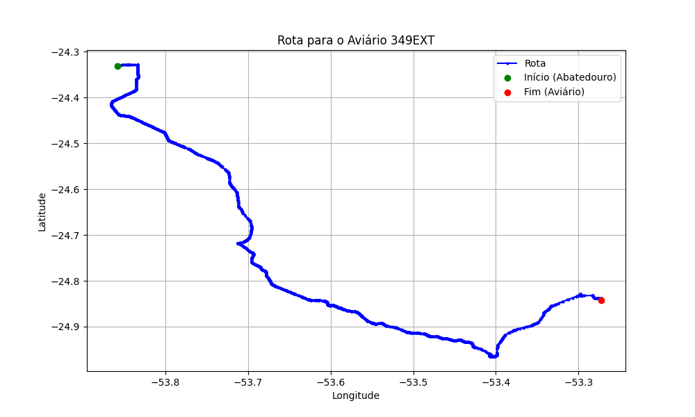

# Relatório de Rota - Aviário 349EXT

## Informações Gerais
- **Produtor:** PLUMA NELSON DREY 1
- **Latitude:** -24.842583
- **Longitude:** -53.27

## Dados da Rota
- **Distância Real:** 124.72 km
- **Tempo Estimado (OSRM):** 107.2 minutos
- **Tempo Estimado (40 km/h):** 187.1 minutos

## Mapa da Rota

[Visualizar Mapa Interativo](mapa_interativo.html)

## Rota até o aviário
1. Saia da rua sem nome, siga por 10m.
2. Vire à direita na Avenida Ariosvaldo Bitencourt, siga por 200m.
3. Siga em frente na Avenida Ariosvaldo Bitencourt, siga por 2,6 km.
4. Vire em frente na Rodovia Alberto Dalcanale, siga por 51,7 km.
5. Siga em frente na rua sem nome, siga por 230m.
6. Siga em frente na Rodovia Perimetral Norte, siga por 90m.
7. New name em frente na Rodovia José Neves Formighieri, siga por 45,5 km.
8. Siga em frente na rua sem nome, siga por 140m.
9. Off ramp levemente à esquerda na rua sem nome, siga por 310m.
10. Fork levemente à esquerda na rua sem nome, siga por 19,9 km.
11. Vire acentuadamente à direita na rua sem nome, siga por 3,6 km.
12. Vire em frente na Estrada para Santa Rosa, siga por 470m.
13. Você chegará ao aviário 349EXT à esquerda.
