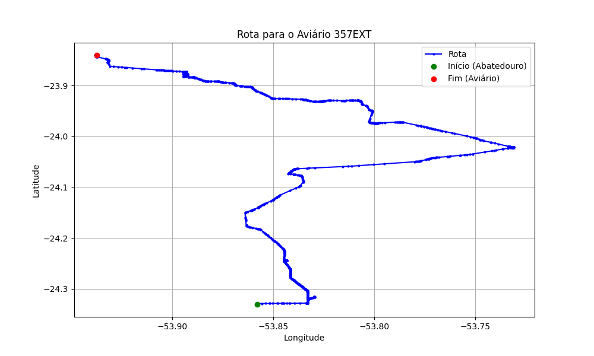

# Relatório de Rota - Aviário 357EXT

## Informações Gerais
- **Produtor:** PLUMA ANTONIO DE CASTRO LIMA 1
- **Latitude:** -23.84025
- **Longitude:** -53.9375

## Dados da Rota
- **Distância Real:** 81.96 km
- **Tempo Estimado (OSRM):** 83.4 minutos
- **Tempo Estimado (40 km/h):** 122.9 minutos

## Mapa da Rota

[Visualizar Mapa Interativo](mapa_interativo.html)

## Rota até o aviário
1. Saia da rua sem nome, siga por 10m.
2. Vire à direita na Avenida Ariosvaldo Bitencourt, siga por 200m.
3. Siga em frente na Avenida Ariosvaldo Bitencourt, siga por 2,5 km.
4. Vire à esquerda na rua sem nome, siga por 1,5 km.
5. Vire levemente à esquerda na rua sem nome, siga por 660m.
6. Vire em frente na Rodovia Alberto Dalcanale, siga por 1,7 km.
7. New name em frente na Avenida Presidente Kennedy, siga por 7,2 km.
8. Fork levemente à direita na rua sem nome, siga por 20,3 km.
9. Vire à direita na Avenida Brigadeiro Pamplona Pinto, siga por 1,1 km.
10. Siga em frente na rua sem nome, siga por 130m.
11. Siga em frente na rua sem nome, siga por 12,0 km.
12. Vire levemente à direita na rua sem nome, siga por 190m.
13. Fork levemente à direita na rua sem nome, siga por 70m.
14. New name em frente na rua sem nome, siga por 26,4 km.
15. Vire levemente à direita na rua sem nome, siga por 490m.
16. Roundabout em frente na Avenida Governador Viriato Parigot de Souza, siga por 30m.
17. Exit roundabout à direita na Avenida Governador Viriato Parigot de Souza, siga por 250m.
18. Vire à direita na Avenida XV de Novembro, siga por 460m.
19. Rotary levemente à direita na Avenida Sete de Setembro, siga por 190m.
20. Exit rotary à direita na Avenida Sete de Setembro, siga por 1,3 km.
21. New name em frente na Rodovia João Barião (Ex Estrada Mestre), siga por 2,7 km.
22. Vire à direita na Estrada São Tomé, siga por 2,7 km.
23. Vire à direita na rua sem nome, siga por 80m.
24. Você chegará ao aviário 357EXT à direita.
