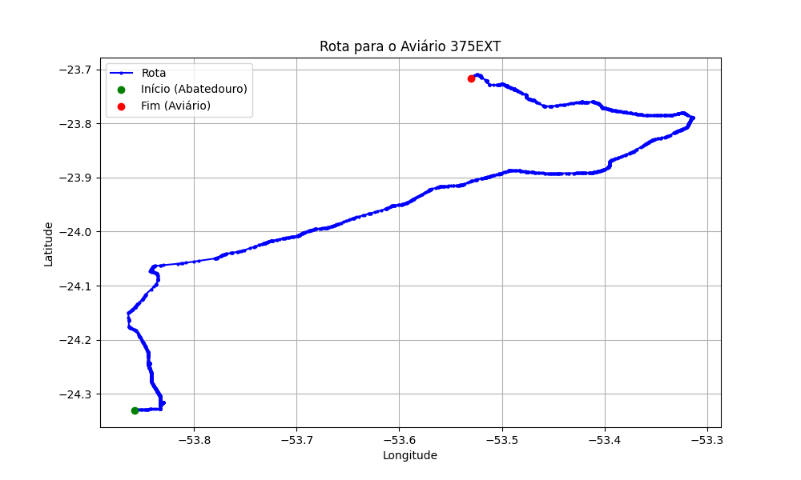

# Relatório de Rota - Aviário 375EXT

## Informações Gerais
- **Produtor:** PLUSVAL IZIDORO BAZANA 1
- **Latitude:** -23.716083
- **Longitude:** -53.530194

## Dados da Rota
- **Distância Real:** 128.28 km
- **Tempo Estimado (OSRM):** 116.7 minutos
- **Tempo Estimado (40 km/h):** 192.4 minutos

## Mapa da Rota

[Visualizar Mapa Interativo](mapa_interativo.html)

## Rota até o aviário
1. Saia da rua sem nome, siga por 10m.
2. Vire à direita na Avenida Ariosvaldo Bitencourt, siga por 200m.
3. Siga em frente na Avenida Ariosvaldo Bitencourt, siga por 2,5 km.
4. Vire à esquerda na rua sem nome, siga por 1,5 km.
5. Vire levemente à esquerda na rua sem nome, siga por 660m.
6. Vire em frente na Rodovia Alberto Dalcanale, siga por 1,7 km.
7. New name em frente na Avenida Presidente Kennedy, siga por 7,2 km.
8. Fork levemente à direita na rua sem nome, siga por 20,3 km.
9. Vire à direita na Avenida Brigadeiro Pamplona Pinto, siga por 1,1 km.
10. Siga em frente na rua sem nome, siga por 130m.
11. Siga em frente na rua sem nome, siga por 12,0 km.
12. Vire levemente à direita na rua sem nome, siga por 140m.
13. Siga em frente na rua sem nome, siga por 60m.
14. Siga em frente na rua sem nome, siga por 23,7 km.
15. Vire em frente na rua sem nome, siga por 28,7 km.
16. Off ramp levemente à direita na rua sem nome, siga por 110m.
17. Vire em frente na Rua Manoel Ramirez, siga por 540m.
18. Vire levemente à direita na rua sem nome, siga por 90m.
19. Vire à direita na Avenida Doutor Ângelo Moreira da Fonseca, siga por 1,3 km.
20. Vire levemente à esquerda na rua sem nome, siga por 30m.
21. Vire levemente à esquerda na PR-489, siga por 19,7 km.
22. Roundabout à direita na Avenida Alberto Byigton, siga por 80m.
23. Exit roundabout em frente na Avenida Alberto Byigton, siga por 380m.
24. Roundabout à direita na Avenida Roque Conçalves, siga por 50m.
25. Exit roundabout em frente na Avenida Roque Conçalves, siga por 440m.
26. Rotary à direita na rua sem nome, siga por 230m.
27. Exit rotary à direita na rua sem nome, siga por 1,9 km.
28. Vire à direita na Estrada Mancini, siga por 2,6 km.
29. Vire à esquerda na rua sem nome, siga por 1,0 km.
30. Você chegará ao aviário 375EXT à direita.
