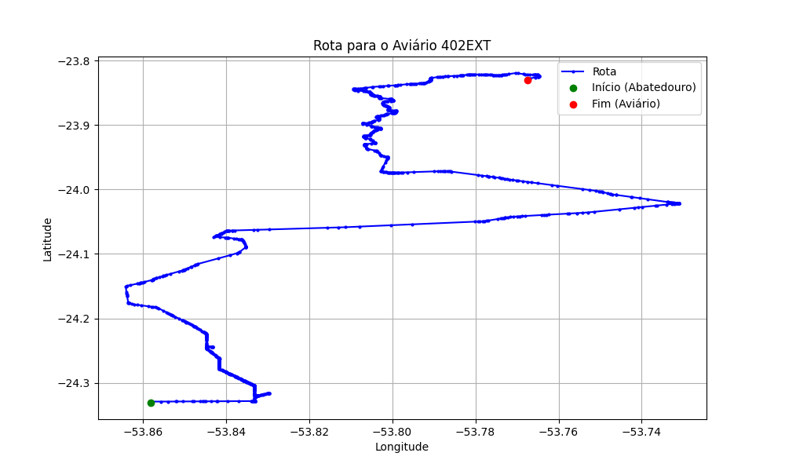

# Relatório de Rota - Aviário 402EXT

## Informações Gerais
- **Produtor:** PLUSVAL CLOVIS APARECIDO LEMES 1
- **Latitude:** -23.829833
- **Longitude:** -53.766944

## Dados da Rota
- **Distância Real:** 79.75 km
- **Tempo Estimado (OSRM):** 86.8 minutos
- **Tempo Estimado (40 km/h):** 119.6 minutos

## Mapa da Rota

[Visualizar Mapa Interativo](mapa_interativo.html)

## Rota até o aviário
1. Saia da rua sem nome, siga por 10m.
2. Vire à direita na Avenida Ariosvaldo Bitencourt, siga por 200m.
3. Siga em frente na Avenida Ariosvaldo Bitencourt, siga por 2,5 km.
4. Vire à esquerda na rua sem nome, siga por 1,5 km.
5. Vire levemente à esquerda na rua sem nome, siga por 660m.
6. Vire em frente na Rodovia Alberto Dalcanale, siga por 1,7 km.
7. New name em frente na Avenida Presidente Kennedy, siga por 7,2 km.
8. Fork levemente à direita na rua sem nome, siga por 20,3 km.
9. Vire à direita na Avenida Brigadeiro Pamplona Pinto, siga por 1,1 km.
10. Siga em frente na rua sem nome, siga por 130m.
11. Siga em frente na rua sem nome, siga por 12,0 km.
12. Vire levemente à direita na rua sem nome, siga por 190m.
13. Fork levemente à direita na rua sem nome, siga por 70m.
14. New name em frente na rua sem nome, siga por 14,2 km.
15. Vire em frente na rua sem nome, siga por 90m.
16. Fork levemente à direita na Rua dos Agricultores, siga por 240m.
17. New name em frente na Estrada Ouro Verde, siga por 11,9 km.
18. New name em frente na rua sem nome, siga por 4,2 km.
19. Vire à direita na Estrada Corcovado, siga por 570m.
20. Fork levemente à direita na Estrada Corcovado, siga por 1,0 km.
21. Você chegará ao aviário 402EXT à esquerda.
