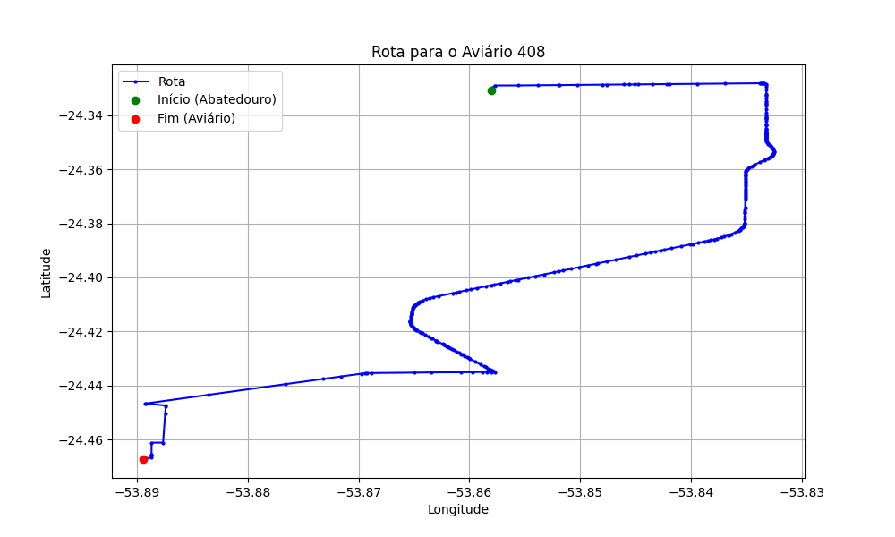

# Relatório de Rota - Aviário 408

## Informações Gerais
- **Produtor:** JAIR VANDERLEI SEIBOTH
- **Latitude:** -24.466635
- **Longitude:** -53.890195

## Dados da Rota
- **Distância Real:** 22.05 km
- **Tempo Estimado (OSRM):** 31.4 minutos
- **Tempo Estimado (40 km/h):** 33.1 minutos

## Mapa da Rota

[Visualizar Mapa Interativo](mapa_interativo.html)

## Rota até o aviário
1. Saia da rua sem nome, siga por 10m.
2. Vire à direita na Avenida Ariosvaldo Bitencourt, siga por 200m.
3. Siga em frente na Avenida Ariosvaldo Bitencourt, siga por 2,6 km.
4. Vire em frente na Rodovia Alberto Dalcanale, siga por 13,1 km.
5. Vire acentuadamente à direita na rua sem nome, siga por 3,6 km.
6. Vire acentuadamente à esquerda na rua sem nome, siga por 2,3 km.
7. Vire em frente na rua sem nome, siga por 190m.
8. Você chegará ao aviário 408 à direita.
