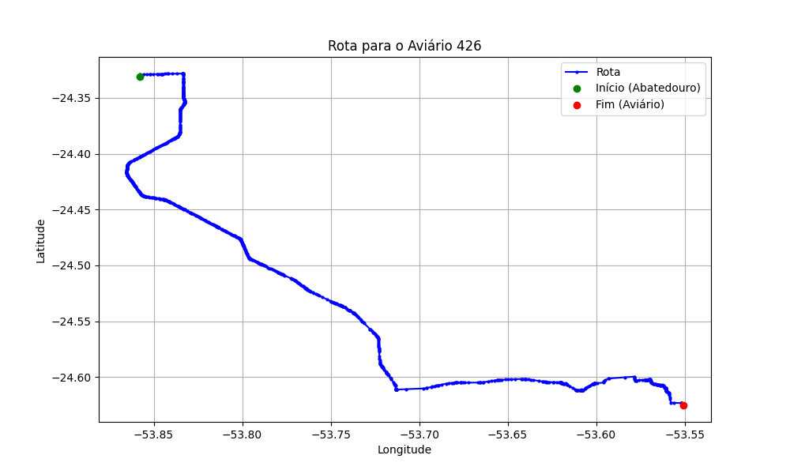

# Relatório de Rota - Aviário 426

## Informações Gerais
- **Produtor:** JOSE BATTISTI
- **Latitude:** -24.625611
- **Longitude:** -53.551278

## Dados da Rota
- **Distância Real:** 61.45 km
- **Tempo Estimado (OSRM):** 67.6 minutos
- **Tempo Estimado (40 km/h):** 92.2 minutos

## Mapa da Rota

[Visualizar Mapa Interativo](mapa_interativo.html)

## Rota até o aviário
1. Saia da rua sem nome, siga por 10m.
2. Vire à direita na Avenida Ariosvaldo Bitencourt, siga por 200m.
3. Siga em frente na Avenida Ariosvaldo Bitencourt, siga por 2,6 km.
4. Vire em frente na Rodovia Alberto Dalcanale, siga por 38,7 km.
5. Vire levemente à esquerda na rua sem nome, siga por 130m.
6. Vire à esquerda na rua sem nome, siga por 9,6 km.
7. Fork levemente à direita na rua sem nome, siga por 210m.
8. Vire à esquerda na Travessa iguaçu, siga por 100m.
9. Vire à direita na Rua São Pedro, siga por 1,6 km.
10. New name em frente na rua sem nome, siga por 1,2 km.
11. Vire à esquerda na rua sem nome, siga por 2,0 km.
12. New name à direita na rua sem nome, siga por 2,7 km.
13. Vire à direita na rua sem nome, siga por 290m.
14. New name em frente na rua sem nome, siga por 1,2 km.
15. Vire à esquerda na rua sem nome, siga por 840m.
16. Você chegará ao aviário 426 à direita.
