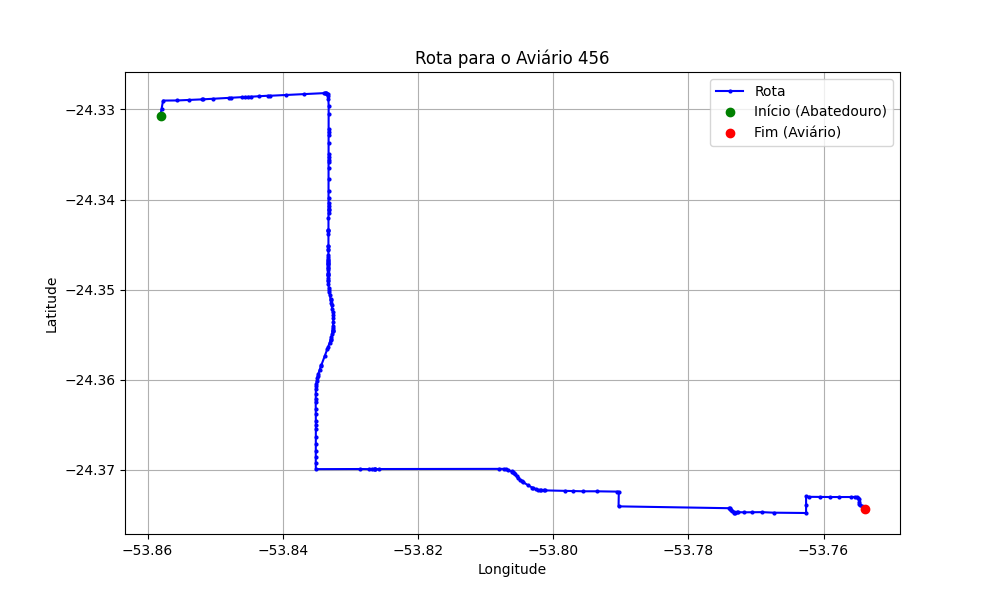

# Relatório de Rota - Aviário 456

## Informações Gerais
- **Produtor:** GABRIEL MATEUS TAIT
- **Latitude:** -24.374531
- **Longitude:** -53.753835

## Dados da Rota
- **Distância Real:** 16.14 km
- **Tempo Estimado (OSRM):** 27.4 minutos
- **Tempo Estimado (40 km/h):** 24.2 minutos

## Mapa da Rota

[Visualizar Mapa Interativo](mapa_interativo.html)

## Rota até o aviário
1. Saia da rua sem nome, siga por 10m.
2. Vire à direita na Avenida Ariosvaldo Bitencourt, siga por 200m.
3. Siga em frente na Avenida Ariosvaldo Bitencourt, siga por 2,6 km.
4. Vire em frente na Rodovia Alberto Dalcanale, siga por 4,5 km.
5. Vire à esquerda na rua sem nome, siga por 4,6 km.
6. End of road à direita na rua sem nome, siga por 180m.
7. Vire à esquerda na rua sem nome, siga por 2,8 km.
8. Vire à esquerda na rua sem nome, siga por 200m.
9. Vire à direita na rua sem nome, siga por 960m.
10. Você chegará ao aviário 456 à direita.
