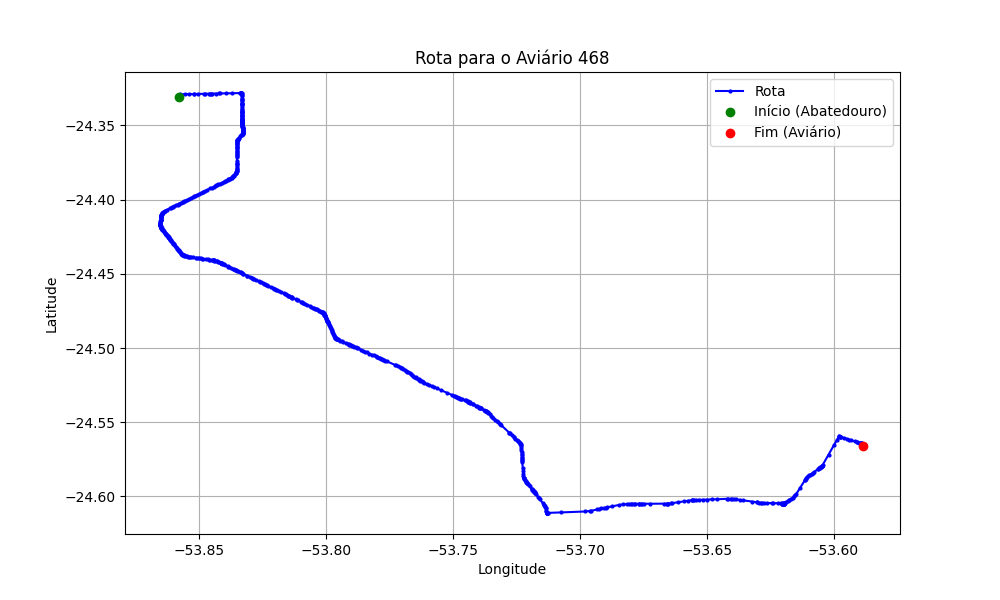

# Relatório de Rota - Aviário 468

## Informações Gerais
- **Produtor:** ANTONIO ALEIXO
- **Latitude:** -24.566417
- **Longitude:** -53.587917

## Dados da Rota
- **Distância Real:** 58.24 km
- **Tempo Estimado (OSRM):** 54.6 minutos
- **Tempo Estimado (40 km/h):** 87.4 minutos

## Mapa da Rota

[Visualizar Mapa Interativo](mapa_interativo.html)

## Rota até o aviário
1. Saia da rua sem nome, siga por 10m.
2. Vire à direita na Avenida Ariosvaldo Bitencourt, siga por 200m.
3. Siga em frente na Avenida Ariosvaldo Bitencourt, siga por 2,6 km.
4. Vire em frente na Rodovia Alberto Dalcanale, siga por 38,7 km.
5. Vire levemente à esquerda na rua sem nome, siga por 130m.
6. Vire à esquerda na rua sem nome, siga por 9,6 km.
7. Fork levemente à esquerda na rua sem nome, siga por 5,6 km.
8. Vire acentuadamente à direita na rua sem nome, siga por 1,2 km.
9. Vire à direita na rua sem nome, siga por 110m.
10. Você chegará ao aviário 468 à esquerda.
