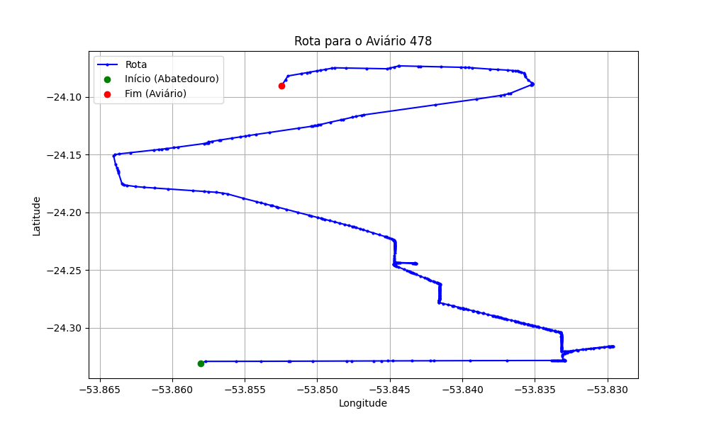

# Relatório de Rota - Aviário 478

## Informações Gerais
- **Produtor:** MARIO JOSE MOLINARI
- **Latitude:** -24.0905
- **Longitude:** -53.853417

## Dados da Rota
- **Distância Real:** 36.64 km
- **Tempo Estimado (OSRM):** 42.8 minutos
- **Tempo Estimado (40 km/h):** 55.0 minutos

## Mapa da Rota

[Visualizar Mapa Interativo](mapa_interativo.html)

## Rota até o aviário
1. Saia da rua sem nome, siga por 10m.
2. Vire à direita na Avenida Ariosvaldo Bitencourt, siga por 200m.
3. Siga em frente na Avenida Ariosvaldo Bitencourt, siga por 2,5 km.
4. Vire à esquerda na rua sem nome, siga por 1,5 km.
5. Vire levemente à esquerda na rua sem nome, siga por 660m.
6. Vire em frente na Rodovia Alberto Dalcanale, siga por 1,7 km.
7. New name em frente na Avenida Presidente Kennedy, siga por 7,2 km.
8. Fork levemente à direita na rua sem nome, siga por 20,3 km.
9. New name em frente na Avenida João Cortez Capel, siga por 160m.
10. Vire à esquerda na Rua Euridice Biral, siga por 290m.
11. Vire à direita na Rua Pastor Amélio Luiz Pereira, siga por 380m.
12. End of road à esquerda na Estrada Três Perobas, siga por 1,8 km.
13. Você chegará ao aviário 478 à direita.
